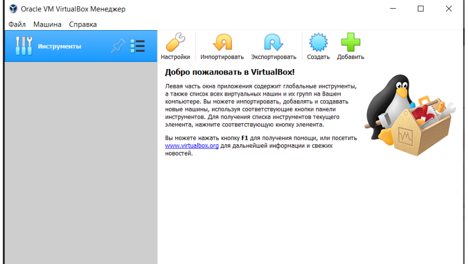
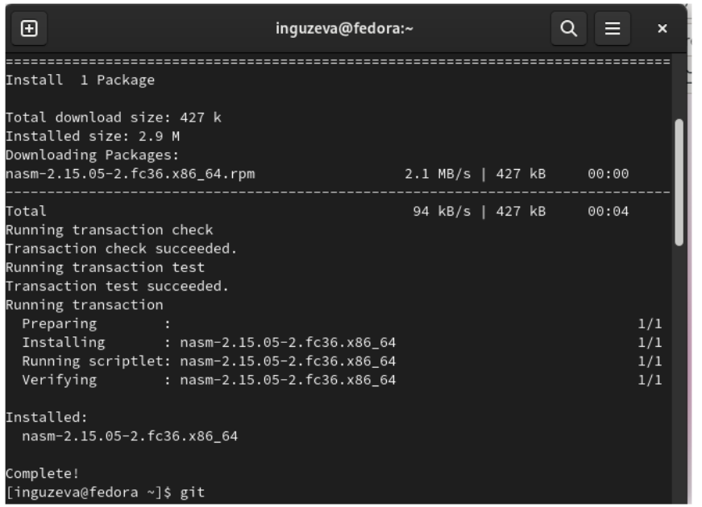
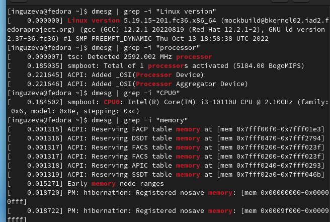

---
## Front matter
lang: ru-RU
title: Презентация №1
subtitle: Установка Linux
author:
  - Кулябов Д. С.
institute:
  - Российский университет дружбы народов, Москва, Россия
  - Объединённый институт ядерных исследований, Дубна, Россия
date: 01 января 1970

## i18n babel
babel-lang: russian
babel-otherlangs: english

## Formatting pdf
toc: false
toc-title: Содержание
slide_level: 2
aspectratio: 169
section-titles: true
theme: metropolis
header-includes:
 - \metroset{progressbar=frametitle,sectionpage=progressbar,numbering=fraction}
 - '\makeatletter'
 - '\beamer@ignorenonframefalse'
 - '\makeatother'
---

## Цели и задачи

1. Установка и запись виртуальной машины
2. Настройка установки ОС
3. Установка ПО
4. Выполнение домашнего задания

## Выполнение лабораторной работы

1. Скачала виртуальную машину и запустила приложение
2. Создала виртуальную машину, указала тип ОС

## Выбор параметров

3. Далее указала все параметры по инструкции, выбрала раскладку, запустила
установку машины на жесткий диск
4. Настроила имя пользователя

## Установка ПО

5. Установила Midnight Commander, git, NASM с помощью командной строки

## Выполнение домашнего задания

6. Нашла версию ядра Linux (Linux version),
частоту процессора (Detected Mhz processor), модель процессора (CPU0),
объём доступной оперативной памяти (Memory available), тип обнаруженного гипервизора (Hypervisor detected), тип файловой системы корневого раздела, последовательность монтирования файловых систем с помощью команды dmesg | grep -i

## Вывод

Благодаря данной лабораторной работе я научилась устанавливать ОС на
виртуальную машину, устанавливать необходимое ПО и находить параметры
компьютера с помощью командной строки.

