---
## Front matter
title: "Лабораторная работа №1"
subtitle: "Установка ОС Linux"
author: "Гузева Ирина Николаевна"

## Generic otions

## Bibliography
bibliography: bib/cite.bib
csl: pandoc/csl/gost-r-7-0-5-2008-numeric.csl

## Pdf output format
toc: true # Table of contents
toc-depth: 2
lof: true # List of figures
lot: true # List of tables
fontsize: 12pt
linestretch: 1.5
papersize: a4
documentclass: scrreprt
## I18n polyglossia
polyglossia-lang:
  name: russian
  options:
	- spelling=modern
	- babelshorthands=true
polyglossia-otherlangs:
  name: english
## I18n babel
babel-lang: russian
babel-otherlangs: english
## Fonts
mainfont: PT Serif
romanfont: PT Serif
sansfont: PT Sans
monofont: PT Mono
mainfontoptions: Ligatures=TeX
romanfontoptions: Ligatures=TeX
sansfontoptions: Ligatures=TeX,Scale=MatchLowercase
monofontoptions: Scale=MatchLowercase,Scale=0.9
## Biblatex
biblatex: true
biblio-style: "gost-numeric"
biblatexoptions:
  - parentracker=true
  - backend=biber
  - hyperref=auto
  - language=auto
  - autolang=other*
  - citestyle=gost-numeric
## Pandoc-crossref LaTeX customization

## Misc options
indent: true
header-includes:
  - \usepackage{indentfirst}
  - \usepackage{float} # keep figures where there are in the text
  - \floatplacement{figure}{H} # keep figures where there are in the text
---

# Цель работы

Целью данной работы является приобретение практических навыков установки операционной системы на виртуальную машину, настройки минимально необходимых для дальнейшей работы сервисов.

# Выполнение лабораторной работы

1. Скачала виртуальную машину (рис. @fig:001).

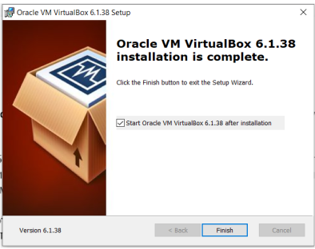{#fig:001 width=70%}

2. Запустила приложение (рис. @fig:002).

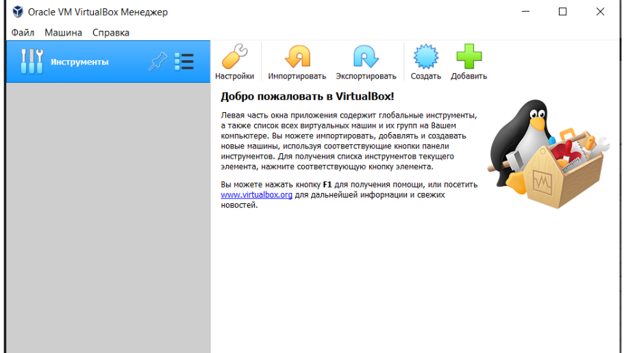{#fig:002 width=70%}

3. Создала виртуальную машину, указала тип ОС (рис. @fig:003).

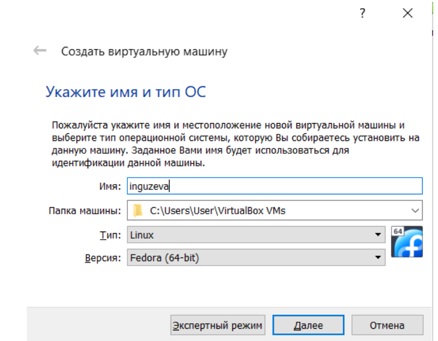{#fig:003 width=70%}

4. Далее указала все параметры по инструкции, выбрала раскладку, запустила установку машины на жесткий диск (рис. @fig:004).

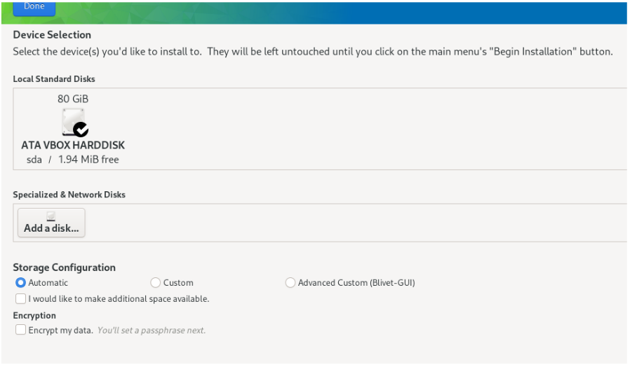{#fig:004 width=70%}

5. Настроила имя пользователя (рис. @fig:005).

{#fig:005 width=70%}

6. Ввела команду для установки Midnight Commander (рис. @fig:006).

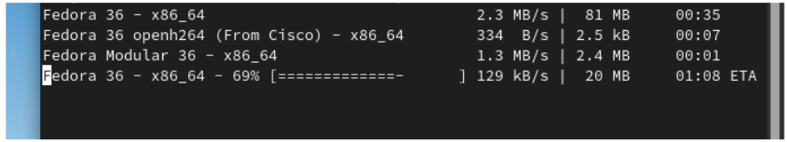{#fig:006 width=70%}

7. Ввела команду для установки git (рис. @fig:007).

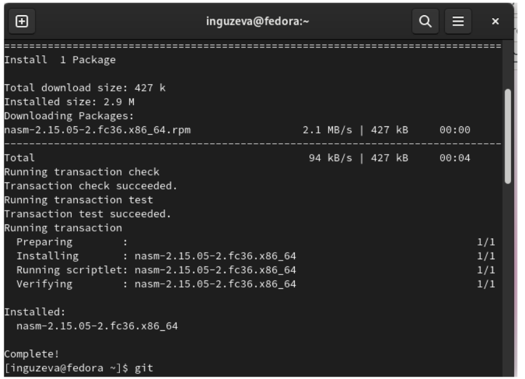{#fig:007 width=70%}

8. Установила NASM git (рис. @fig:008).

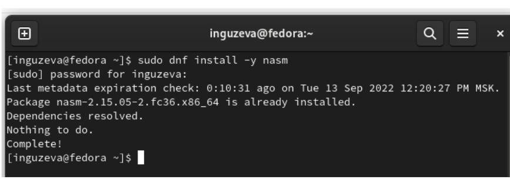{#fig:008 width=70%}

9. Переходим к домашнему заданию. Нашла версию ядра Linux (Linux version), частоту процессора (Detected Mhz processor), модель процессора (CPU0), объём доступной оперативной памяти (Memory available) с помощью команды dmesg | grep -i (рис. @fig:009).

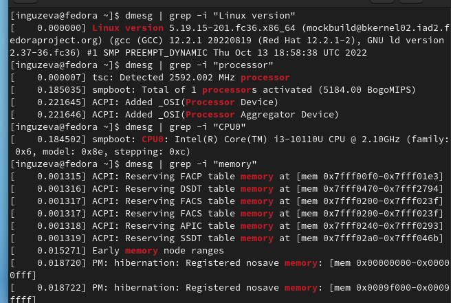{#fig:009 width=70%}

10. Нашла тип обнаруженного гипервизора (Hypervisor detected). (рис. @fig:010).

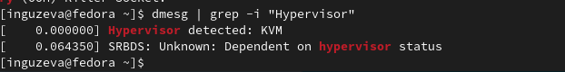{#fig:010 width=70%}

11. Нашла тип файловой системы корневого раздела (рис. @fig:011).

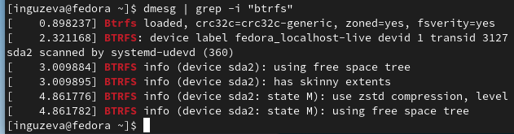{#fig:011 width=70%}

12. Нашла последовательность монтирования файловых систем (рис. @fig:012).

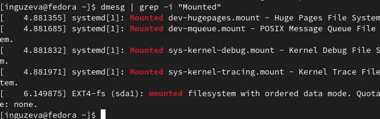{#fig:012 width=70%}

# Выводы

Благодаря данной лабораторной работе я научилась устанавливать ОС на виртуальную машину, устанавливать необходимое ПО и находить параметры компьютера с помощью командной строки.

