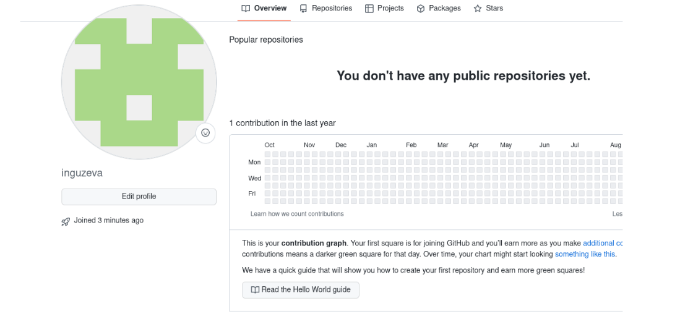

---
## Front matter
lang: ru-RU
title: Презентация №2
subtitle: "Первоначальная настройка git"
author:
  - Гузева Ирина Николаевна
institute:
  - Российский университет дружбы народов, Москва, Россия
  - Объединённый институт ядерных исследований, Дубна, Россия
date: 01 января 1970

## i18n babel
babel-lang: russian
babel-otherlangs: english

## Formatting pdf
toc: false
toc-title: Содержание
slide_level: 2
aspectratio: 169
section-titles: true
theme: metropolis
header-includes:
 - \metroset{progressbar=frametitle,sectionpage=progressbar,numbering=fraction}
 - '\makeatletter'
 - '\beamer@ignorenonframefalse'
 - '\makeatother'
---

## Цели и задачи

- Зарегистрироваться на гитхабе
- Создать базовую конфигурацию для работы с git
- Создать ключи SSH, PGP
- Настроить подписи git
- Создать локальный каталог для выполнения заданий по предмету

## Выполнение лабораторной работы

1. Создала учетную запись на гитхабе и сделала предварительную конфигурацию

## Создание ключен

2. Сгенерировала ключ SSH

3. Сгенерировала ключ PGP

## Настройка каталога git

4. Настроила подписи

5. Создала репозиторий курса и клонировала его 

## Вывод

В ходе лабораторной работы я приобрела практические навыки по работе с
системой git.
