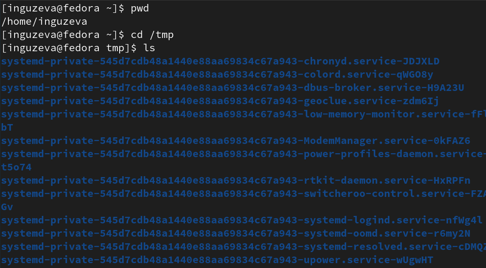
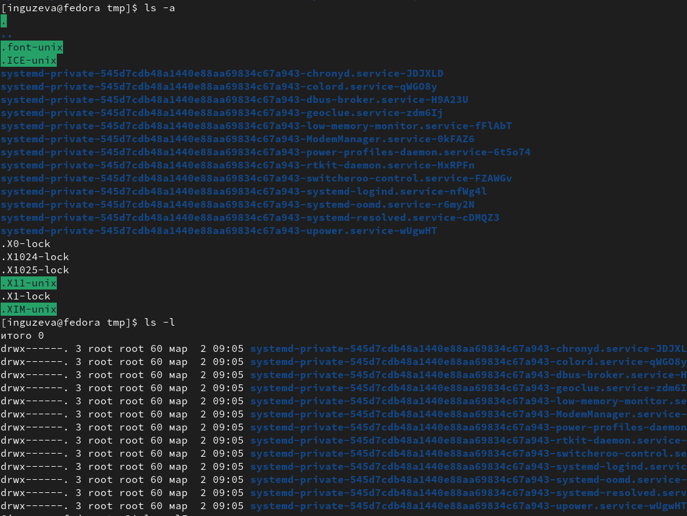
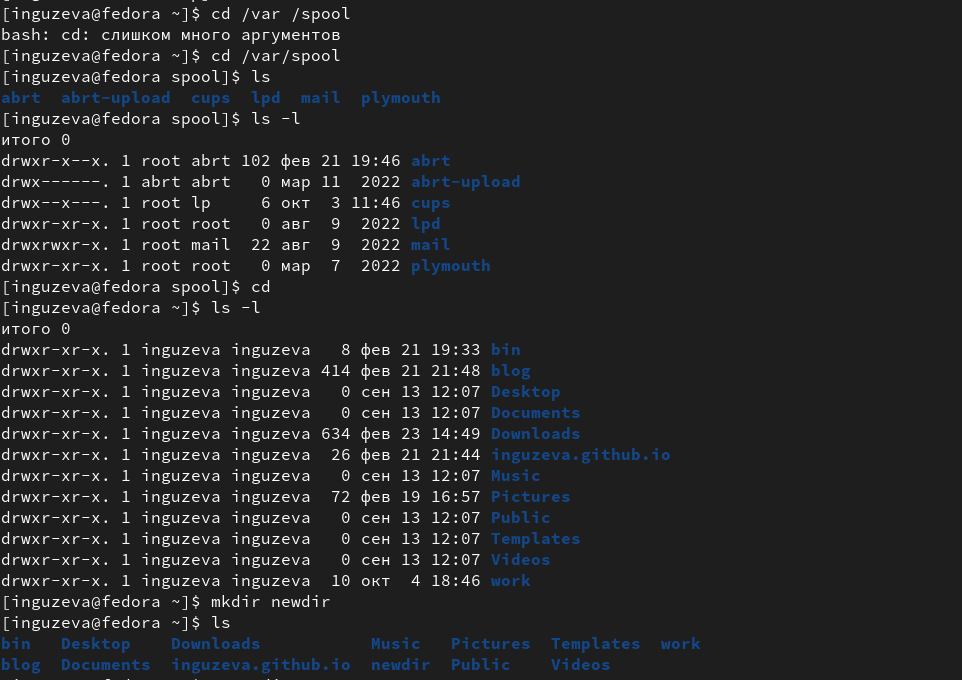
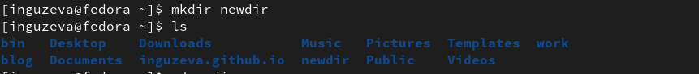
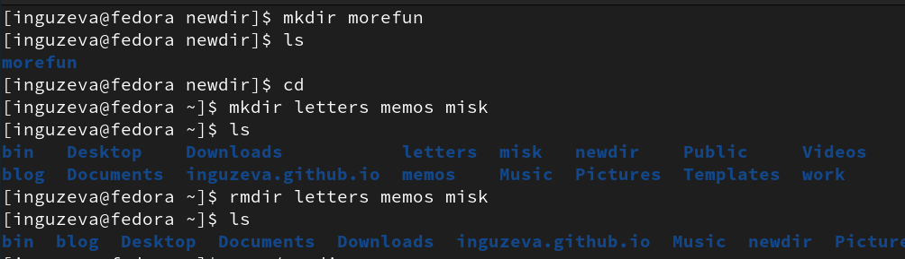
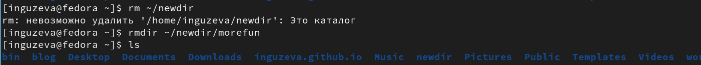
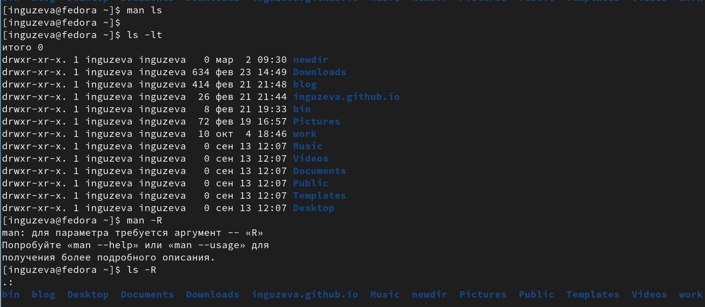
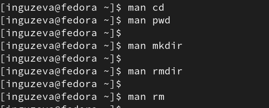
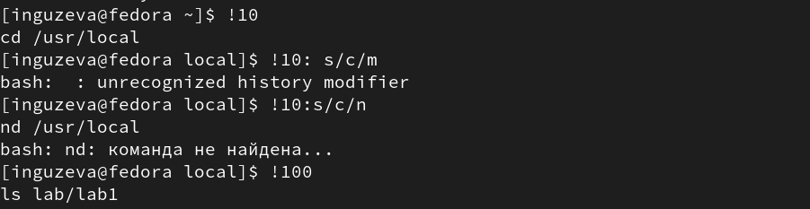

---
## Front matter
lang: ru-RU
title: Презентация №4
subtitle: "Основы интерфейса взаимодействия пользователя с системой Unix на
уровне командной строки"
author:
  - Гузева Ирина Николаевна
institute:
  - Российский университет дружбы народов, Москва, Россия
  - Объединённый институт ядерных исследований, Дубна, Россия
date: 01 января 1970

## i18n babel
babel-lang: russian
babel-otherlangs: english

## Formatting pdf
toc: false
toc-title: Содержание
slide_level: 2
aspectratio: 169
section-titles: true
theme: metropolis
header-includes:
 - \metroset{progressbar=frametitle,sectionpage=progressbar,numbering=fraction}
 - '\makeatletter'
 - '\beamer@ignorenonframefalse'
 - '\makeatother'
---

## Цель

Приобретение практических навыков взаимодействия пользователя с системой посредством командной строки.

## Выполнение лабораторной работы

1. Определила полное имя вашего домашнего каталога с помощью команды
pwd.Перешла в каталог /tmp с помощью команды cd. Вывела на экран
содержимое каталога /tmp с помощью команды ls

{ #fig:001 width=50% }

## Опции команды ls

2. Вывела разные опции с помощью команды ls

{ #fig:002 width=50% }

## Команды cd, ls, mkdir

3. Определила, что в каталоге /var/spool нет подкаталога с именем cron. Пере-
шла в домашний каталог и вывела на экран его содержимое. Подтвердила,
что я являюсь владельцем

{ #fig:003 width=50% }

## Cоздание нового каталога

4. Создала новый каталог с именем newdir

{ #fig:004 width=50% }

## Создание и удаление новых каталогов

5. В каталоге ~/newdir создала новый каталог с именем morefun. В домашнем
каталоге создала одной командой три новых каталога с именами letters,
memos, misk. Затем удалила эти каталоги одной командой

{ #fig:005 width=50% }

## Удалeние созданного каталога

6. Попробовала удалить ранее созданный каталог ~/newdir командой rm, не по-
лучилось. Удалила каталог ~/newdir/morefun из домашнего каталога, каталог
удалился

{ #fig:006 width=50% }

## Просмотр каталогов и подкатологов, сортировка

7. С помощью команды man определила, какую опцию команды ls нужно ис-
пользовать для просмотра содержимое не только указанного каталога, но
и подкаталогов, входящих в него -R, определите набор опций команды ls,
позволяющий отсортировать по времени последнего изменения выводи-
мый список содержимого каталога с развёрнутым описанием файлов -lt

{ #fig:007 width=50% }

## Команда man

8. Используя команду man для просмотра описания следующих команд: cd,
pwd, mkdir, rmdir, rm

{ #fig:008 width=50% }

## Команда history

9. Используя информацию, полученную при помощи команды history, выпол-
нила модификацию и исполнение нескольких команд из буфера команд

{ #fig:009 width=50% } 

## Вывод
В ходе лабораторной работы я приобрела навыки работы в командной строке.

