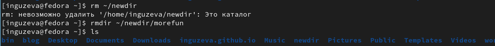
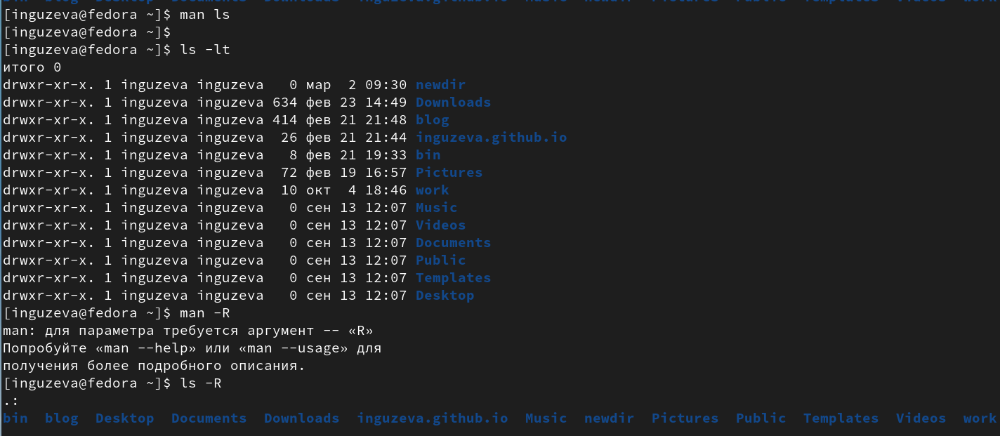
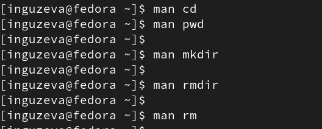
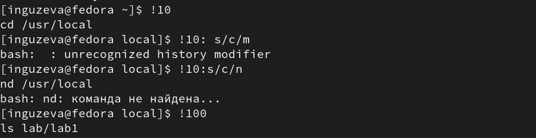

---
## Front matter
title: "Лабораторная работа №4"
subtitle: "Основы интерфейса взаимодействия пользователя с системой Unix на уровне командной строки"
author: "Гузева Ирина Николаевна"

## Generic otions
lang: ru-RU

## Bibliography
bibliography: bib/cite.bib
csl: pandoc/csl/gost-r-7-0-5-2008-numeric.csl

## Pdf output format
toc: true # Table of contents
toc-depth: 2
lof: true # List of figures
lot: true # List of tables
fontsize: 12pt
linestretch: 1.5
papersize: a4
documentclass: scrreprt
## I18n polyglossia
polyglossia-lang:
  name: russian
  options:
	- spelling=modern
	- babelshorthands=true
polyglossia-otherlangs:
  name: english
## I18n babel
babel-lang: russian
babel-otherlangs: english
## Fonts
mainfont: PT Serif
romanfont: PT Serif
sansfont: PT Sans
monofont: PT Mono
mainfontoptions: Ligatures=TeX
romanfontoptions: Ligatures=TeX
sansfontoptions: Ligatures=TeX,Scale=MatchLowercase
monofontoptions: Scale=MatchLowercase,Scale=0.9
## Biblatex
biblatex: true
biblio-style: "gost-numeric"
biblatexoptions:
  - parentracker=true
  - backend=biber
  - hyperref=auto
  - language=auto
  - autolang=other*
  - citestyle=gost-numeric
## Pandoc-crossref LaTeX customization

## Misc options
indent: true
header-includes:
  - \usepackage{indentfirst}
  - \usepackage{float} # keep figures where there are in the text
  - \floatplacement{figure}{H} # keep figures where there are in the text
---

# Цель работы

Приобретение практических навыков взаимодействия пользователя с системой посредством командной строки.

# Теоретическое введение

Основным интерфейсом взаимодействия пользователя с операционной системой UNIX во всех её модификациях была и остается командная строка. Командная строка (или «консоль») – это текстовый интерфейс между человеком и компьютером, в котором инструкции компьютеру даются путём ввода с клавиатуры текстовых строк (команд). Интерфейс командной строки противопоставляется управлению программами на основе меню, а также различным реализациям графического интерфейса. Команды, введённые пользователем, интерпретируются и выполняются специальной программой — командной оболочкой.

# Выполнение лабораторной работы

1) Определила полное имя вашего домашнего каталога с помощью команды pwd.Перешла в каталог /tmp с помощью команды cd. Выведите на экран содержимое каталога /tmp с помощью команды ls (рис. [-@fig:001])

{ #fig:001 width=70% }

2) Вывела разные опции с помощью команды ls (рис. [-@fig:002])

{ #fig:002 width=70% }

3) Определила, что в каталоге /var/spool нет подкаталога с именем cron. Перешла в домашний каталог и вывела на экран его содержимое. Подтвердила, что я являюсь владельцем (рис. [-@fig:003])

{ #fig:003 width=70% }

4) Создала новый каталог с именем newdir (рис. [-@fig:004])

{ #fig:004 width=70% }

5) В каталоге ~/newdir создала новый каталог с именем morefun. В домашнем каталоге создала одной командой три новых каталога с именами
letters, memos, misk. Затем удалила эти каталоги одной командой (рис. [-@fig:005])

{ #fig:005 width=70% }

6) Попробовала удалить ранее созданный каталог ~/newdir командой rm, не получилось. Удалила каталог ~/newdir/morefun из домашнего каталога, каталог удалился (рис. [-@fig:006])

{ #fig:006 width=70% }

7) С помощью команды man определила, какую опцию команды ls нужно использовать для просмотра содержимое не только указанного каталога, но и подкаталогов,
входящих в него -R, определите набор опций команды ls, позволяющий отсортировать по времени последнего изменения выводимый список содержимого каталога
с развёрнутым описанием файлов -lt (рис. [-@fig:007])

{ #fig:007 width=70% }

8) Используя команду man для просмотра описания следующих команд: cd, pwd, mkdir,
rmdir, rm (рис. [-@fig:008])

{ #fig:008 width=70% }

9) Используя информацию, полученную при помощи команды history, выполнила модификацию и исполнение нескольких команд из буфера команд (рис. [-@fig:009])

{ #fig:009 width=70% }

# Выводы
В ходе лабораторной работы я приобрела навыки работы в командной строке.

## Ответы на контрольные вопросы

1.	Что такое командная строка? Командная строка (или «консоль») – это текстовый интерфейс между человеком и компьютером, в котором инструкции компьютеру даются путём ввода с клавиатуры текстовых строк (команд). Интерфейс командной строки противопоставляется управлению программами на основе меню, а также различным реализациям графического интерфейса. Команды, введённые пользователем, интерпретируются и выполняются специальной программой — командной оболочкой (или «shell» по-английски).

2.	При помощи какой команды можно определить абсолютный путь текущего каталога? Приведите пример. Для определения абсолютного пути к текущему каталогу используется команда pwd (print working directory). Пример (абсолютное имя текущего каталога пользователя dharma): (pwd результат: /afs/dk.sci.pfu.edu.ru/home/d/h/dharma)

3.	При помощи какой команды и каких опций можно определить только тип файлов и их имена в текущем каталоге? Приведите примеры. При помощи команды ls -F. (ls -F install-tl-unx/ newdir/ work/ Видео/ Документы/ Загрузки/ Изображения/ Музыка/ Общедоступные/ ‘Рабочий стол’/ Шаблоны/)

4.	Каким образом отобразить информацию о скрытых файлах? Приведите примеры. С помощью команды ls -a. (ls -a . .bash_logout .cache .gnupg .local .pki .var .vboxclient-draganddrop.pid .wget-hsts Документы Музыка Шаблоны .. .bash_profile .config install-tl-unx .mozilla .ssh .vboxclient-clipboard.pid .vboxclient-seamless.pid work Загрузки Общедоступные .bash_history .bashrc .gitconfig .lesshst newdir .texlive2022 .vboxclient-display-svga-x11.pid .vscode Видео Изображения ‘Рабочий стол’)

5.	При помощи каких команд можно удалить файл и каталог? Можно ли это сделать одной и той же командой? Приведите примеры. Команда rm используется для удаления файлов и/или каталогов. Чтобы удалить каталог, содержащий файлы, нужно использовать опцию r. Без указания этой опции команда не будет выполняться (rm -r abc). Если каталог пуст, то можно воспользоваться командой rmdir. Если удаляемый каталог содержит файлы, то команда не будет выполнена — нужно использовать rm - r имя_каталога.

6.	Каким образом можно вывести информацию о последних выполненных пользователем командах? работы? С помощью команды history.

7.	Как воспользоваться историей команд для их модифицированного выполнения? Приведите примеры. Можно модифицировать команду из выведенного на экран списка при помощи следующей конструкции: !:s// (!3:s/a/F ls -F)

8.	Приведите примеры запуска нескольких команд в одной строке. Если требуется выполнить последовательно несколько команд, записанный в одной строке, то для этого используется символ точка с запятой. (cd; ls)

9.	Дайте определение и приведите примера символов экранирования. Если в заданном контексте встречаются специальные символы (типа «.», «/», «*» и т.д.), надо перед ними поставить символ экранирования  (обратный слэш).

10.	Охарактеризуйте вывод информации на экран после выполнения команды ls с опцией
l.	Чтобы вывести на экран подробную информацию о файлах и каталогах, необходимо использовать опцию l. При этом о каждом файле и каталоге будет выведена следующая информация: – тип файла, – право доступа, – число ссылок, – владелец, – размер, – дата последней ревизии, – имя файла или каталога.

11.	Что такое относительный путь к файлу? Приведите примеры использования относительного и абсолютного пути при выполнении какой-либо команды. Относительный путь — это ссылка, указывающая на другие страницы вашего сайта относительно веб-страницы, на которой эта ссылка уже находится. Пример относительно пути: ./docs/files/file.txt Пример абсолютного пути: cd /home/dmbelicheva/work/study

12.	Как получить информацию об интересующей вас команде? С помощью команды hepl.

13.	Какая клавиша или комбинация клавиш служит для автоматического дополнения вводимых команд? Клавиша Tab.

