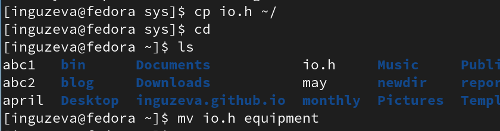
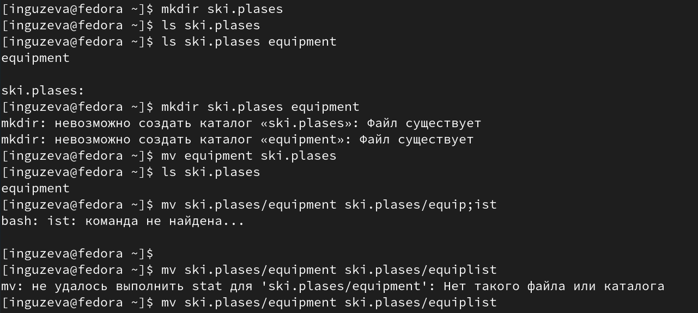
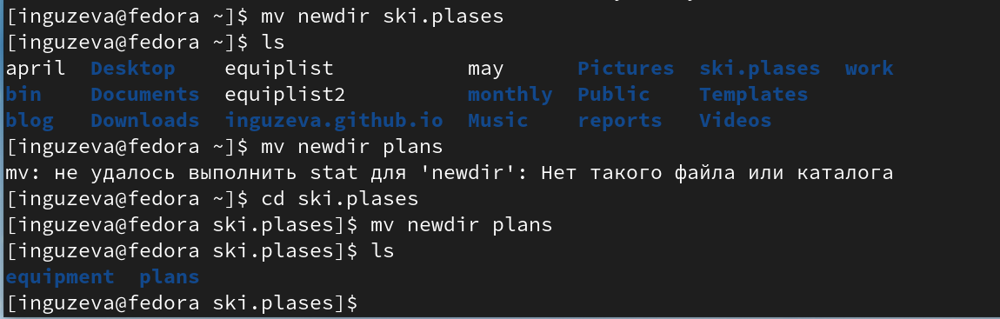
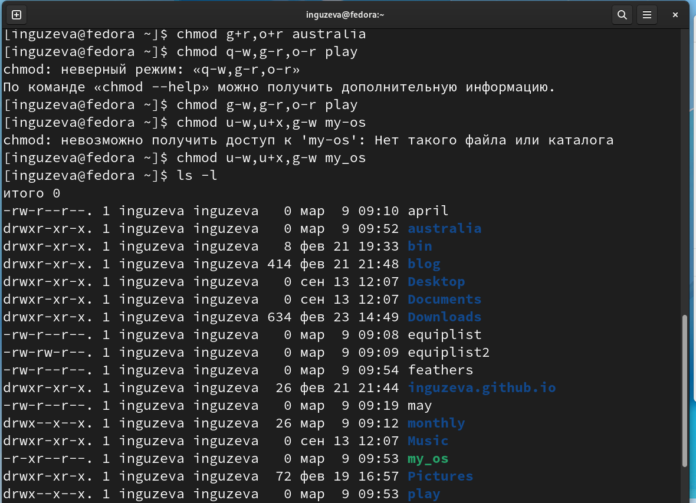
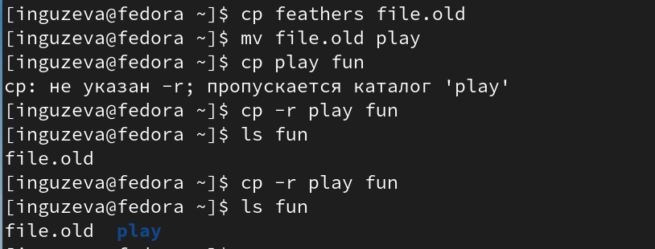
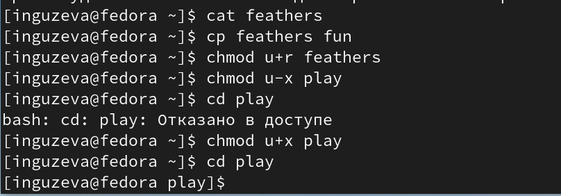
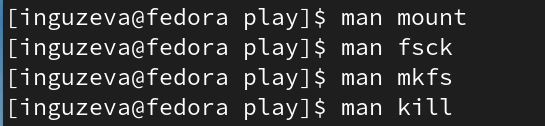

---
## Front matter
lang: ru-RU
title: Презентация №5
subtitle: "Анализ файловой системы Linux. Команды для работы с файлами и
каталогами"
author:
  - Гузева Ирина Николаевна
institute:
  - Российский университет дружбы народов, Москва, Россия
  - Объединённый институт ядерных исследований, Дубна, Россия
date: 10 марта 2023

## i18n babel
babel-lang: russian
babel-otherlangs: english

## Formatting pdf
toc: false
toc-title: Содержание
slide_level: 2
aspectratio: 169
section-titles: true
theme: metropolis
header-includes:
 - \metroset{progressbar=frametitle,sectionpage=progressbar,numbering=fraction}
 - '\makeatletter'
 - '\beamer@ignorenonframefalse'
 - '\makeatother'
---

## Цель

Ознакомление с файловой системой Linux, её структурой, именами и содержа-
нием каталогов. Приобретение практических навыков по применению команд
для работы с файлами и каталогами, по управлению процессами (и работами),
по проверке использования диска и обслуживанию файловой системы.

## Выполнение лабораторной работы

1. Скопировала файл /usr/include/sys/io.h в домашний каталог и назвала его
equipment
{ #fig:001 width=50% }

## Создание директории, перенос и изменение названия файлов

2. В домашнем каталоге создала директорию ~/ski.plases. Переместила файл
equipment в каталог ~/ski.plases. Переименовала файл ~/ski.plases/equipment
в ~/ski.plases/equiplist.

{ #fig:002 width=50% }

## Создание, копирование, перемещение файлов

3. Создала в домашнем каталоге файл abc1 и скопировала его в каталог
~/ski.plases, назвала его equiplist2.Создала каталог с именем equipment в
каталоге ~/ski.plases. Переместила файлы ~/ski.plases/equiplist и equiplist2 в
каталог ~/ski.plases/equipment.

{ #fig:003 width=50% }

## Cоздание нового каталога

4. Создала и переместила каталог ~/newdir в каталог ~/ski.plases и назовите
его plans

{ #fig:004 width=50% }

## Команда chmod

5. Определила опции команды chmod, необходимые для того, чтобы присво-
ить перечисленным ниже файлам выделенные права доступа, считая, что
8в начале таких прав нет: drwxr–r– … australia drwx–x–x … play -r-xr–r– …
my_os -rw-rw-r– … feathers

{ #fig:005 width=50% }

## Просмотр содержимого файла

6. Просмотрела содержимое файла /etc/password.

{ #fig:006 width=50% }

## Копия файлов и каталогов

7. Скопировала файл ~/feathers в файл ~/file.old. Переместила файл ~/file.old
в каталог ~/play. Скопировала каталог ~/play в каталог ~/fun. Переместила
каталог ~/fun в каталог ~/play и назвала его games.

{ #fig:007 width=50% }

## Команда chmod

8. Лишила владельца файла ~/feathers права на чтение. Дала владельцу файла
~/feathers право на чтение. Лишила владельца каталога ~/play права на
выполнение. Дала владельцу каталога ~/play право на выполнение.

{ #fig:008 width=50% }

## Команда man

9. Прочитала man по командам mount, fsck, mkfs, kill

{ #fig:009 width=50% } 

## Вывод

В ходе лабораторной работы я приобрела практические навыки по работе с
файлами и каталогами, по управлению процессами (и работами), по проверке
использования диска и обслуживанию файловой системы.
