---
## Front matter
lang: ru-RU
title: Презентация №6
subtitle: "Поиск файлов. Перенаправление ввода-вывода. Просмотр запущенных
процессов"
author:
  - Гузева Ирина Николаевна
institute:
  - Российский университет дружбы народов, Москва, Россия
  - Объединённый институт ядерных исследований, Дубна, Россия
date: 14 марта 2023

## i18n babel
babel-lang: russian
babel-otherlangs: english

## Formatting pdf
toc: false
toc-title: Содержание
slide_level: 2
aspectratio: 169
section-titles: true
theme: metropolis
header-includes:
 - \metroset{progressbar=frametitle,sectionpage=progressbar,numbering=fraction}
 - '\makeatletter'
 - '\beamer@ignorenonframefalse'
 - '\makeatother'
---

## Цель

Ознакомление с инструментами поиска файлов и фильтрации текстовых дан-
ных. Приобретение практических навыков: по управлению процессами (и зада-
ниями), по проверке использования диска и обслуживанию файловых систем.

## Выполнение лабораторной работы

1. Записала в файл file.txt названия файлов, содержащихся в каталоге /etc. Дописала в этот же файл названия файлов, содержащихся в домашнем каталоге. (рис. [-@fig:001], [-@fig:002])

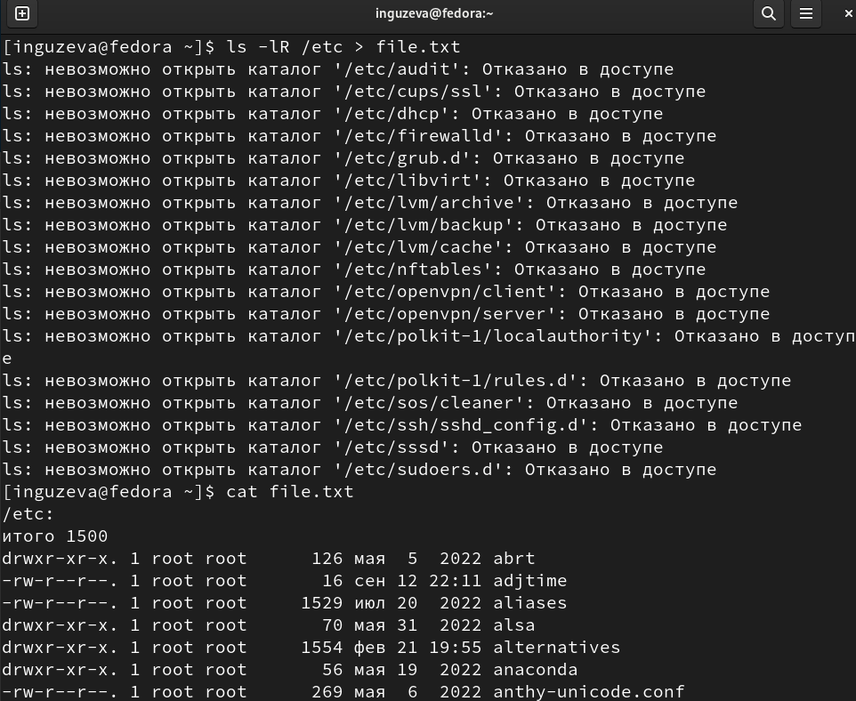{ #fig:001 width=50% }

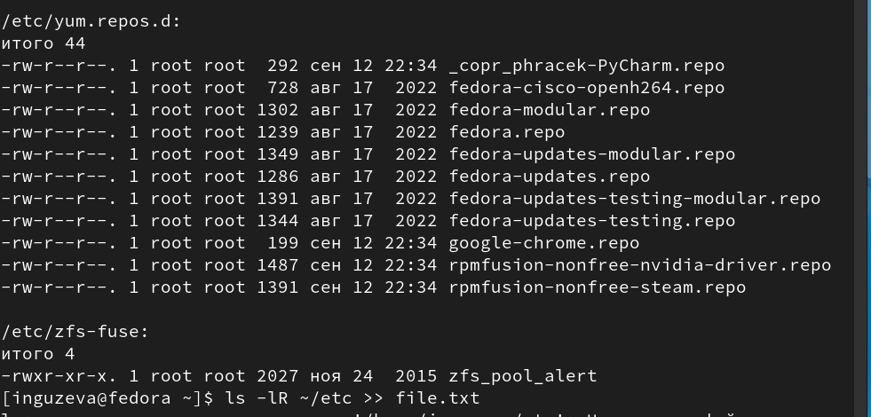{ #fig:002 width=50% }

## Команды grep, cat

2. Вывела имена всех файлов из file.txt, имеющих расширение .conf, после чего
запишисала их в новый текстовой файл conf.txt. (рис. [-@fig:003], [-@fig:004])

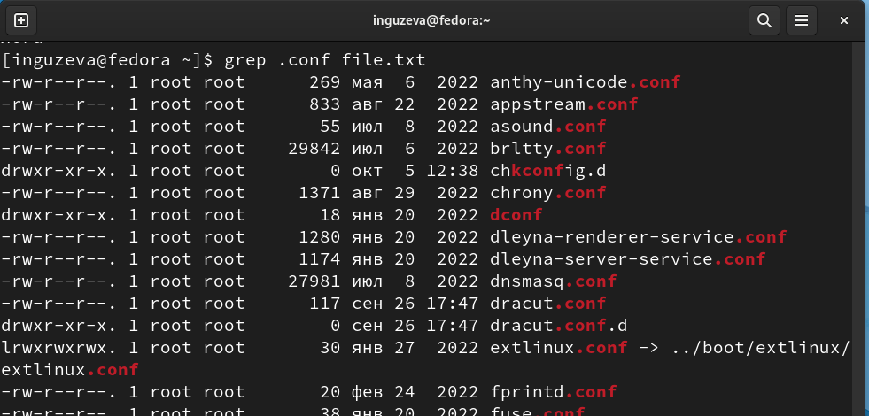{ #fig:003 width=30% }
 
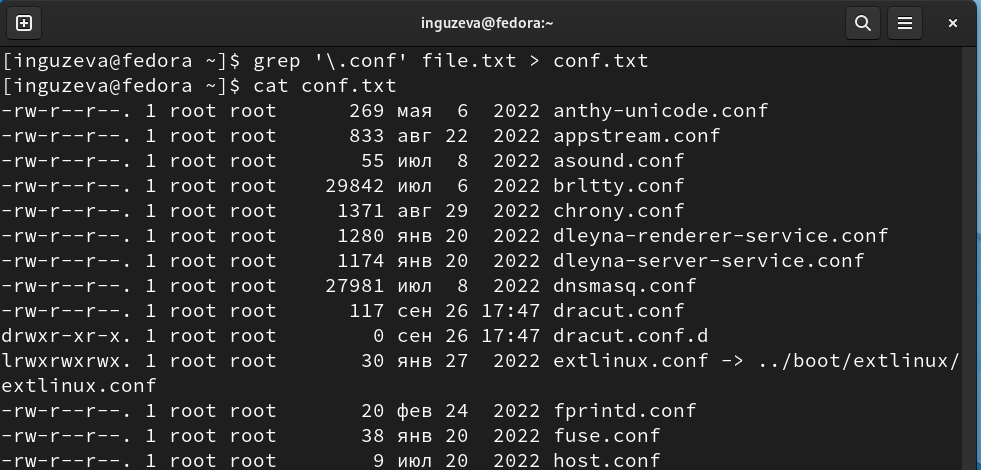{ #fig:004 width=30% }

## Команды find, ls -l

3. Определила, какие файлы в домашнем каталоге имеют имена, начинавшиеся
с символа c (рис. [-@fig:005], [-@fig:006])

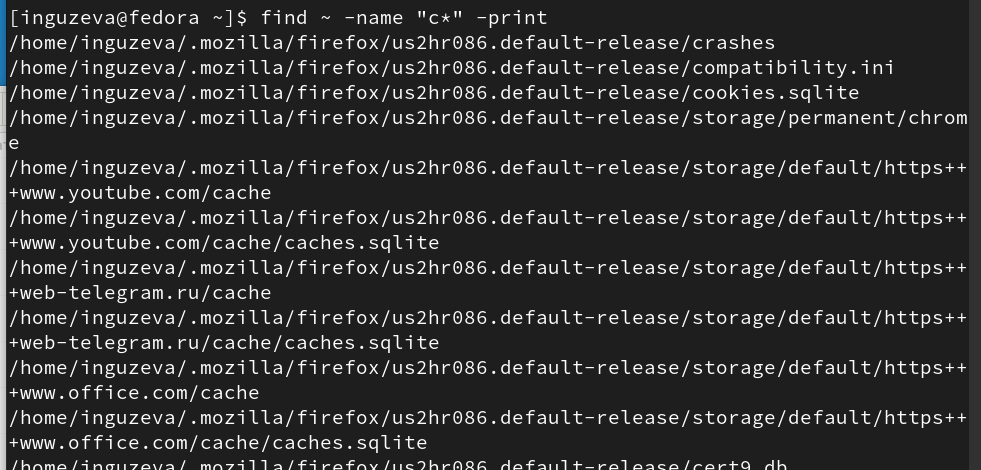{ #fig:005 width=30% }

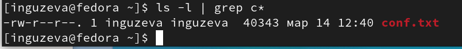{ #fig:006 width=30% }

## Команда find

4. Вывела на экран (по странично) имена файлов из каталога /etc, начинающиеся
с символа h. (рис. [-@fig:007])

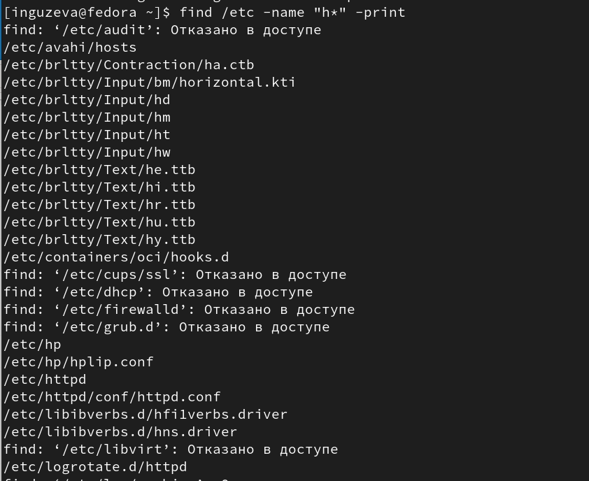{ #fig:007 width=50% }

## Команды find, rm

5. Запустила в фоновом режиме процесс, который будет записывать в файл ~/logfile
файлы, имена которых начинаются с log. Удалила файл ~/logfile. Запустила из консоли в фоновом режиме редактор gedit. (рис. [-@fig:008])

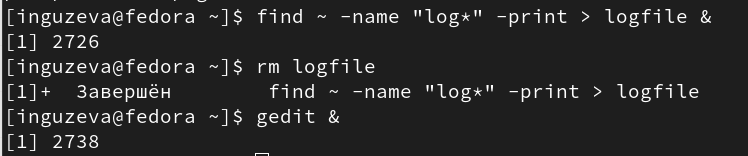{ #fig:008 width=50% }

## Команды ps aux, pgrep

6. Определила идентификатор процесса gedit, используя команду ps, конвейер и фильтр
grep (рис. [-@fig:009])

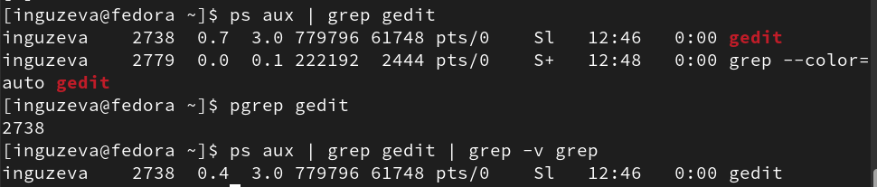{ #fig:009 width=50% }

## Команды man, kill, df, du

7. Прочла справку (man) команды kill, после чего использовала её для завершения
процесса gedit. Выполнила команды df и du, предварительно получив более подробную информацию
об этих командах, с помощью команды man. Воспользовавшись справкой команды find, выведите имена всех директорий, имеющихся в вашем домашнем каталоге. (рис. [-@fig:010], [-@fig:011])

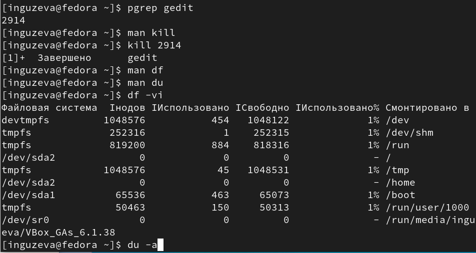{ #fig:010 width=30% }

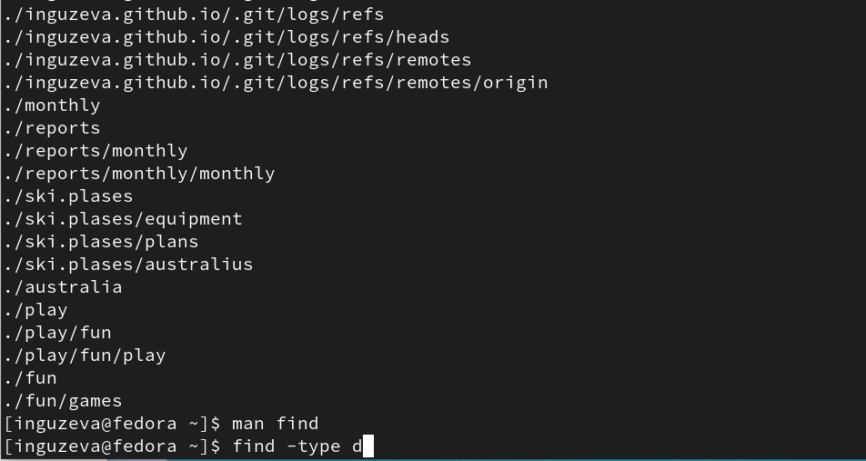{ #fig:011 width=30% }

## Вывод

В процессе выполнения лабораторной работы ознакомилась с инструментами
поиска файлов и фильтрации текстовых данных. Приобрела практические на-
выки: по управлению процессами (и заданиями), по проверке использования
диска и обслуживанию файловых систем.
