---
## Front matter
title: "Лабораторная работа №6"
subtitle: "Поиск файлов. Перенаправление
ввода-вывода. Просмотр запущенных процессов
"
author: "Гузева Ирина Николаевна"

## Generic otions
lang: ru-RU

## Bibliography
bibliography: bib/cite.bib
csl: pandoc/csl/gost-r-7-0-5-2008-numeric.csl

## Pdf output format
toc: true # Table of contents
toc-depth: 2
lof: true # List of figures
lot: true # List of tables
fontsize: 12pt
linestretch: 1.5
papersize: a4
documentclass: scrreprt
## I18n polyglossia
polyglossia-lang:
  name: russian
  options:
	- spelling=modern
	- babelshorthands=true
polyglossia-otherlangs:
  name: english
## I18n babel
babel-lang: russian
babel-otherlangs: english
## Fonts
mainfont: PT Serif
romanfont: PT Serif
sansfont: PT Sans
monofont: PT Mono
mainfontoptions: Ligatures=TeX
romanfontoptions: Ligatures=TeX
sansfontoptions: Ligatures=TeX,Scale=MatchLowercase
monofontoptions: Scale=MatchLowercase,Scale=0.9
## Biblatex
biblatex: true
biblio-style: "gost-numeric"
biblatexoptions:
  - parentracker=true
  - backend=biber
  - hyperref=auto
  - language=auto
  - autolang=other*
  - citestyle=gost-numeric
## Pandoc-crossref LaTeX customization

## Misc options
indent: true
header-includes:
  - \usepackage{indentfirst}
  - \usepackage{float} # keep figures where there are in the text
  - \floatplacement{figure}{H} # keep figures where there are in the text
---

# Цель работы

Ознакомление с инструментами поиска файлов и фильтрации текстовых данных.
Приобретение практических навыков: по управлению процессами (и заданиями), по
проверке использования диска и обслуживанию файловых систем.

# Теоретическое введение

В интерфейсе командной строки есть очень полезная возможность перенаправления (переадресации) ввода и вывода (англ. термин I/O Redirection). Как мы уже заметили, многие программы выводят данные на экран. А ввод данных в терминале осуществляется с клавиатуры. С помощью специальных обозначений можно перенаправить вывод многих команд в файлы или иные устройства вывода (например, распечатать на принтере). Тоже самое и со вводом информации, вместо ввода данных с клавиатуры, для многих программ можно задать считывание символов их файла. Кроме того, можно даже вывод одной программы передать на ввод другой программе. [@Entr:bash]

К каждой программе, запускаемой в командной строке, по умолчанию подключено три потока данных:

STDIN (0) — стандартный поток ввода (данные, загружаемые в программу). STDOUT (1) — стандартный поток вывода (данные, которые выводит программа). По умолчанию — терминал. STDERR (2) — стандартный поток вывода диагностических и отладочных сообщений (например, сообщениях об ошибках). По умолчанию — терминал. [@Conv:bash]

Pipe (конвеер) – это однонаправленный канал межпроцессного взаимодействия. Термин был придуман Дугласом Макилроем для командной оболочки Unix и назван по аналогии с трубопроводом. Конвейеры чаще всего используются в shell-скриптах для связи нескольких команд путем перенаправления вывода одной команды (stdout) на вход (stdin) последующей, используя символ конвеера ‘|’. [@Pipes:bash]

# Выполнение лабораторной работы

1) Записала в файл file.txt названия файлов, содержащихся в каталоге /etc. Дописала в этот же файл названия файлов, содержащихся в домашнем каталоге. (рис. [-@fig:001], [-@fig:002])

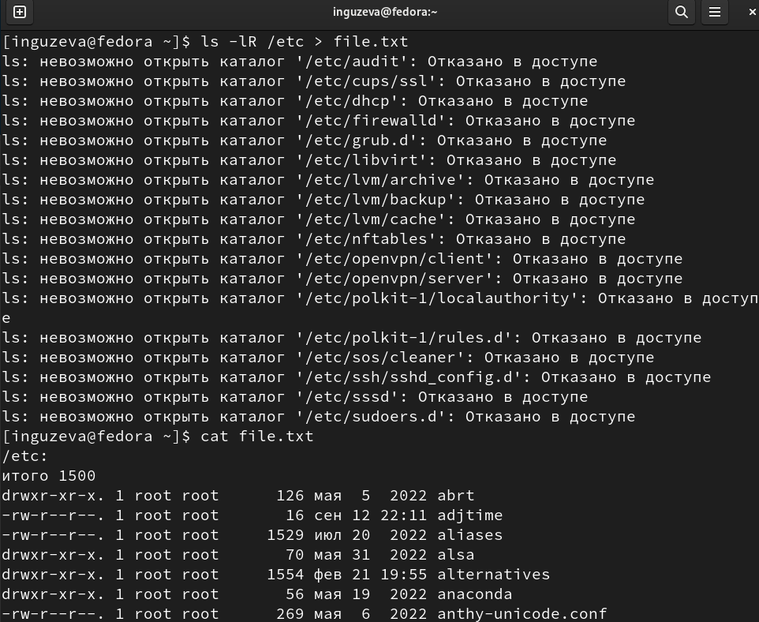{ #fig:001 width=70% }

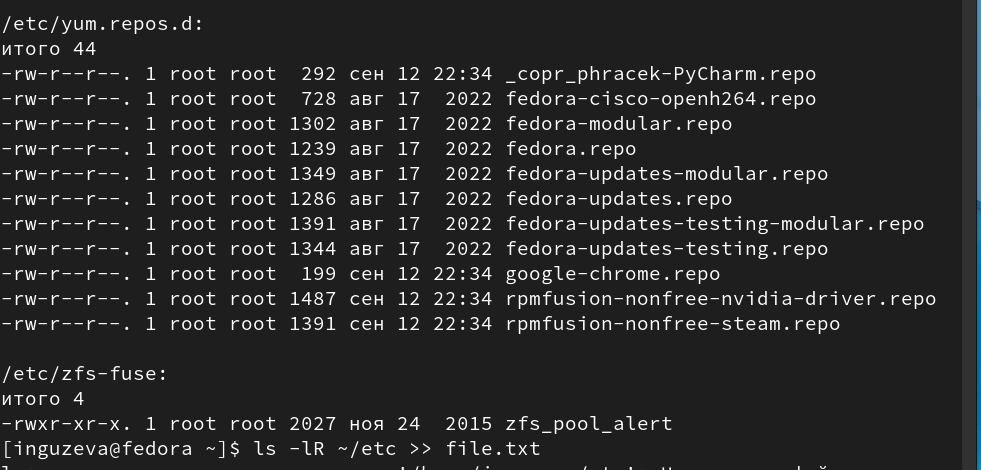{ #fig:002 width=70% }

3) Вывела имена всех файлов из file.txt, имеющих расширение .conf, после чего
запишисала их в новый текстовой файл conf.txt. (рис. [-@fig:003], [-@fig:004])

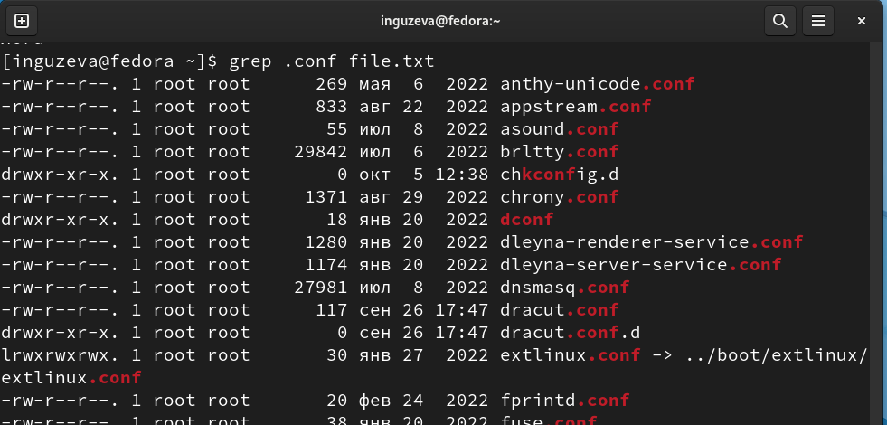{ #fig:003 width=70% }
 
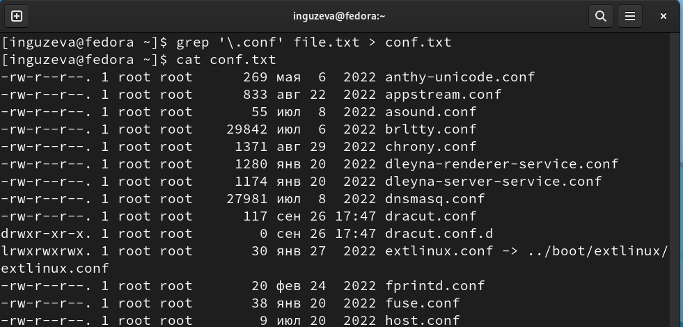{ #fig:004 width=70% }

5) Определила, какие файлы в домашнем каталоге имеют имена, начинавшиеся
с символа c (рис. [-@fig:005], [-@fig:006])

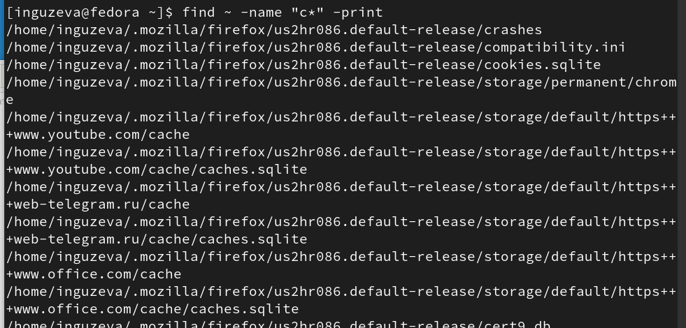{ #fig:005 width=70% }

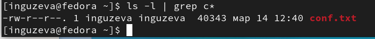{ #fig:006 width=70% }

7) Вывела на экран (по странично) имена файлов из каталога /etc, начинающиеся
с символа h. (рис. [-@fig:007])

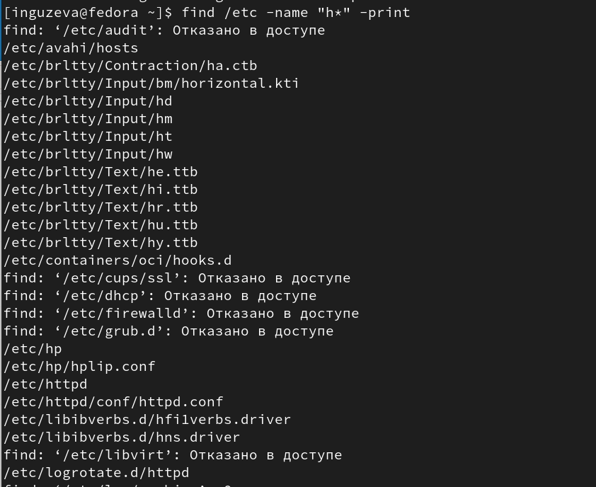{ #fig:007 width=70% }

8) Запустила в фоновом режиме процесс, который будет записывать в файл ~/logfile
файлы, имена которых начинаются с log. Удалила файл ~/logfile. Запустила из консоли в фоновом режиме редактор gedit. (рис. [-@fig:008])

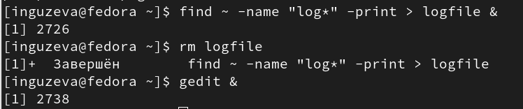{ #fig:008 width=70% }

9) Определила идентификатор процесса gedit, используя команду ps, конвейер и фильтр
grep (рис. [-@fig:009])

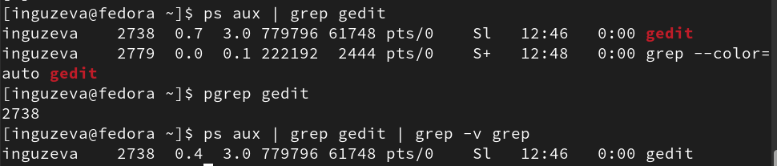{ #fig:009 width=70% }

10) Прочла справку (man) команды kill, после чего использовала её для завершения
процесса gedit. Выполнила команды df и du, предварительно получив более подробную информацию
об этих командах, с помощью команды man. Воспользовавшись справкой команды find, выведите имена всех директорий, имеющихся в вашем домашнем каталоге. (рис. [-@fig:010], [-@fig:011])

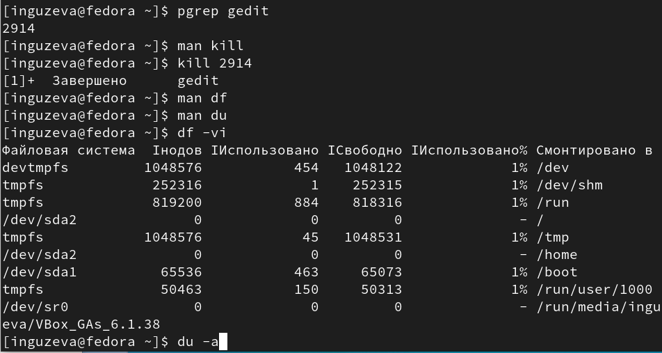{ #fig:010 width=70% }

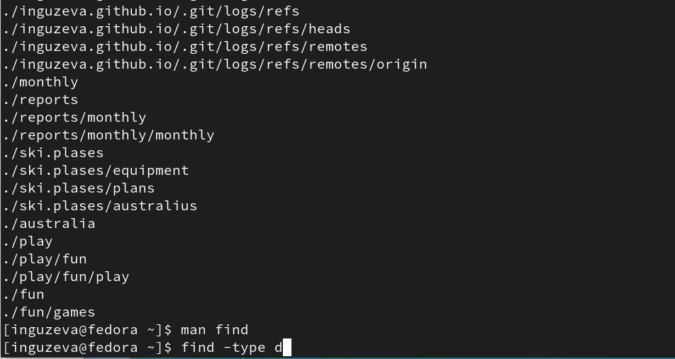{ #fig:011 width=70% }

# Выводы
В процессе выполнения лабораторной работы ознакомилась с инструментами поиска файлов и фильтрации текстовых данных. Приобрела практические навыки: по управлению процессами (и заданиями), по проверке использования диска и обслуживанию файловых систем.

## Ответы на контрольные вопросы

Какие потоки ввода вывода вы знаете?
В системе по умолчанию открыто три специальных потока: – stdin — стандартный поток ввода (по умолчанию: клавиатура), файловый дескриптор 0; – stdout — стандартный поток вывода (по умолчанию: консоль), файловый дескриптор 1; – stderr — стандартный поток вывод сообщений об ошибках (по умолчанию: консоль), файловый дескриптор 2.

Объясните разницу между операцией > и >>.
Этот знак > - перенаправление ввода/вывода, а >> - перенаправление в режиме добавления.

Что такое конвейер?
Конвейер (pipe) служит для объединения простых команд или утилит в цепочки, в которых результат работы предыдущей команды передаётся последующей.

Что такое процесс? Чем это понятие отличается от программы?
Главное отличие между программой и процессом заключается в том, что программа - это набор инструкций, который позволяет ЦПУ выполнять определенную задачу, в то время как процесс - это исполняемая программа.

Что такое PID и GID?
PPID - (parent process ID) идентификатор родительского процесса. Процесс может порождать и другие процессы. UID, GID - реальные идентификаторы пользователя и его группы, запустившего данный процесс.

Что такое задачи и какая команда позволяет ими управлять?
Запущенные фоном программы называются задачами (jobs). Ими можно управлять с помощью команды jobs, которая выводит список запущенных в данный момент задач.

Найдите информацию об утилитах top и htop. Каковы их функции?
Команда htop похожа на команду top по выполняемой функции: они обе показывают информацию о процессах в реальном времени, выводят данные о потреблении системных ресурсов и позволяют искать, останавливать и управлять процессами.

У обеих команд есть свои преимущества. Например, в программе htop реализован очень удобный поиск по процессам, а также их фильтрация. В команде top это не так удобно — нужно знать кнопку для вывода функции поиска.

Зато в top можно разделять область окна и выводить информацию о процессах в соответствии с разными настройками. В целом top намного более гибкая в настройке отображения процессов.

Назовите и дайте характеристику команде поиска файлов. Приведите примеры использования этой команды.
Команда find - это одна из наиболее важных и часто используемых утилит системы Linux. Это команда для поиска файлов и каталогов на основе специальных условий. Ее можно использовать в различных обстоятельствах, например, для поиска файлов по разрешениям, владельцам, группам, типу, размеру и другим подобным критериям.

Утилита find предустановлена по умолчанию во всех Linux дистрибутивах, поэтому вам не нужно будет устанавливать никаких дополнительных пакетов. Это очень важная находка для тех, кто хочет использовать командную строку наиболее эффективно.

Команда find имеет такой синтаксис: find [папка] [параметры] критерий шаблон [действие] Пример: find /etc -name "p*" -print

Можно ли по контексту (содержанию) найти файл? Если да, то как?
find / -type f -exec grep -H 'текстДляПоиска' {} ;

Как определить объем свободной памяти на жёстком диске?
С помощью команды df -h.

Как определить объем вашего домашнего каталога?
С помощью команды du -s.

Как удалить зависший процесс?
С помощью команды kill% номер задачи.
