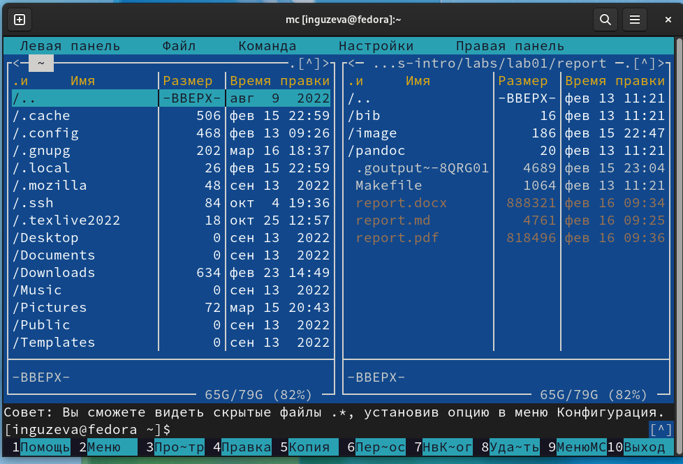
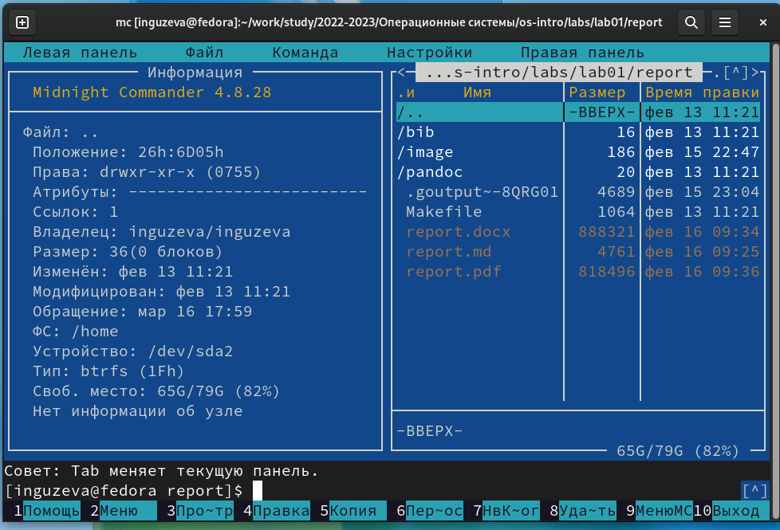
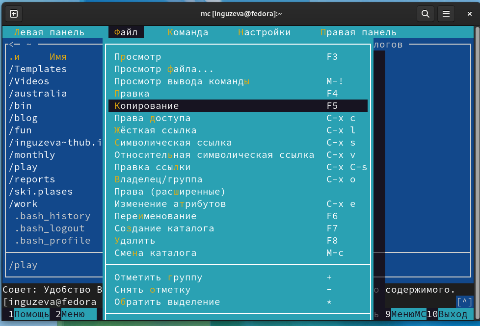
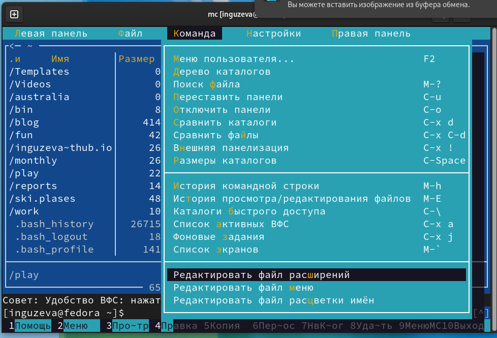
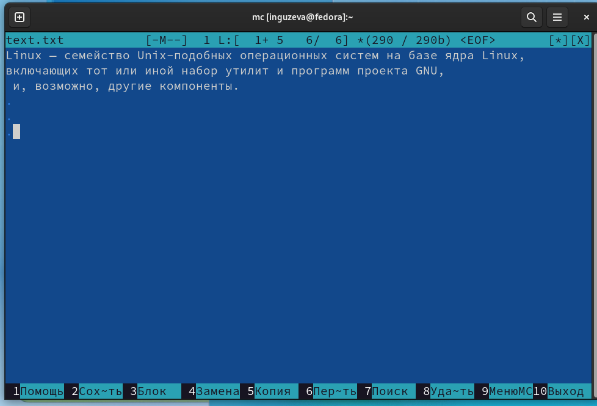
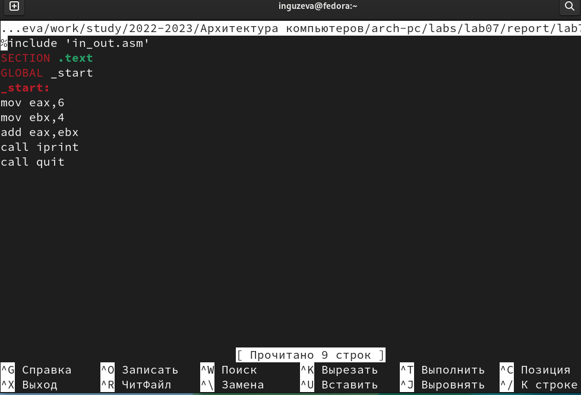

---
## Front matter
lang: ru-RU
title: Презентация №7
subtitle: "Командная оболочка Midnight Commander"
author:
  - Гузева Ирина Николаевна
institute:
  - Российский университет дружбы народов, Москва, Россия
  - Объединённый институт ядерных исследований, Дубна, Россия
date: 22 марта 2023

## i18n babel
babel-lang: russian
babel-otherlangs: english

## Formatting pdf
toc: false
toc-title: Содержание
slide_level: 2
aspectratio: 169
section-titles: true
theme: metropolis
header-includes:
 - \metroset{progressbar=frametitle,sectionpage=progressbar,numbering=fraction}
 - '\makeatletter'
 - '\beamer@ignorenonframefalse'
 - '\makeatother'
---

## Цель

Освоение основных возможностей командной оболочки Midnight Commander.
Приобретение навыков практической работы по просмотру каталогов и файлов;
манипуляций с ними.

## Выполнение лабораторной работы

1. Изучила информацию о mc, вызвав в командной строке man mc. Запустила
из командной строки mc, изучите его структуру и меню.

{ #fig:001 width=50% }

## Выполнение операций и команд левой панели

2. Выполнила несколько операций в mc, используя управляющие клавиши.
Выполнила основные команды меню левой панели.

{ #fig:002 width=50% }

## Файл

3. Используя возможности подменю Файл , выполнила: – просмотр содержи-
мого текстового файла; – редактирование содержимого текстового файла
(без сохранения результатов редактирования); – создание каталога; – копи-
рование в файлов в созданный каталог.

{ #fig:003 width=50% }

## Команда

4. С помощью соответствующих средств подменю Команда осуществила: –
поиск в файловой системе файла с заданными условиями (например, файла
с расширением .c или .cpp, содержащего строку main); – выбор и повторение
одной из предыдущих команд; – переход в домашний каталог; – анализ
файла меню и файла расширений.

{ #fig:004 width=50% }

## Настройки

5. Вызвала подменю Настройки . Освоила операции, определяющие структуру
экрана mc

{ #fig:005 width=50% }

## Работа с текстовым файлом

6. Создала текстовой файл text.txt. Открыла этот файл с помощью встроенного
в mc редактора. Вставила в открытый файл небольшой фрагмент текста.
Проделала с текстом следующие манипуляции, используя горячие клавиши:
• Удалите строку текста.
• Выделила фрагмент текста и скопировала его на новую строку.
• Выделила фрагмент текста и перенесла его на новую строку.
• Сохранила файл.
• Отменила последнее действие.
• Перешла в конец файла (нажав комбинацию клавиш) и написала некоторый
текст.
• Перешла в начало файла (нажав комбинацию клавиш) и написала некото-
рый текст.
• Сохранила и закрыла файл

{ #fig:006 width=20% }

## Работа с программой

7. Открыла файл с исходным текстом на ассемблере. Используя меню редак-
тора, включила подсветку синтаксиса.

{ #fig:007 width=50% }

## Вывод

В процессе выполнения лабораторной работы я освоила работу с командной
оболочкой mc. Приобрела практические навыки работы по просмотру каталогов
и файлов и по манипуляции с ними.
