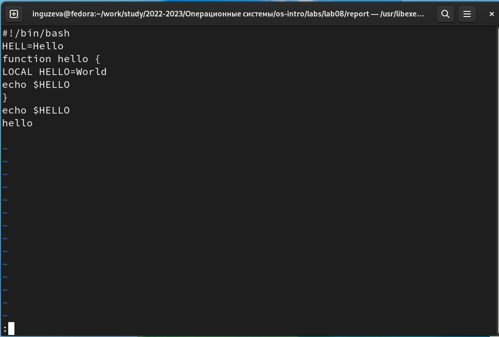
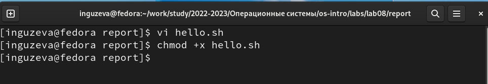
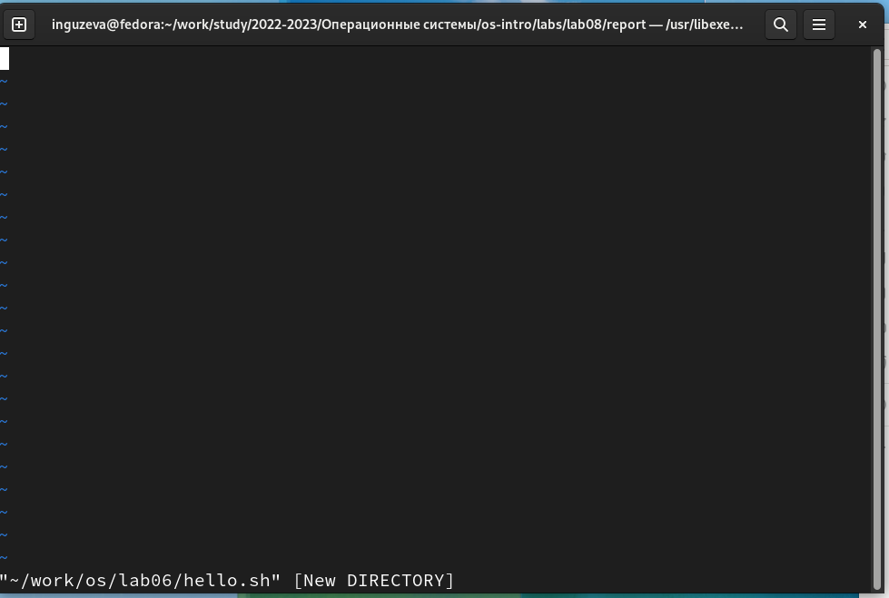
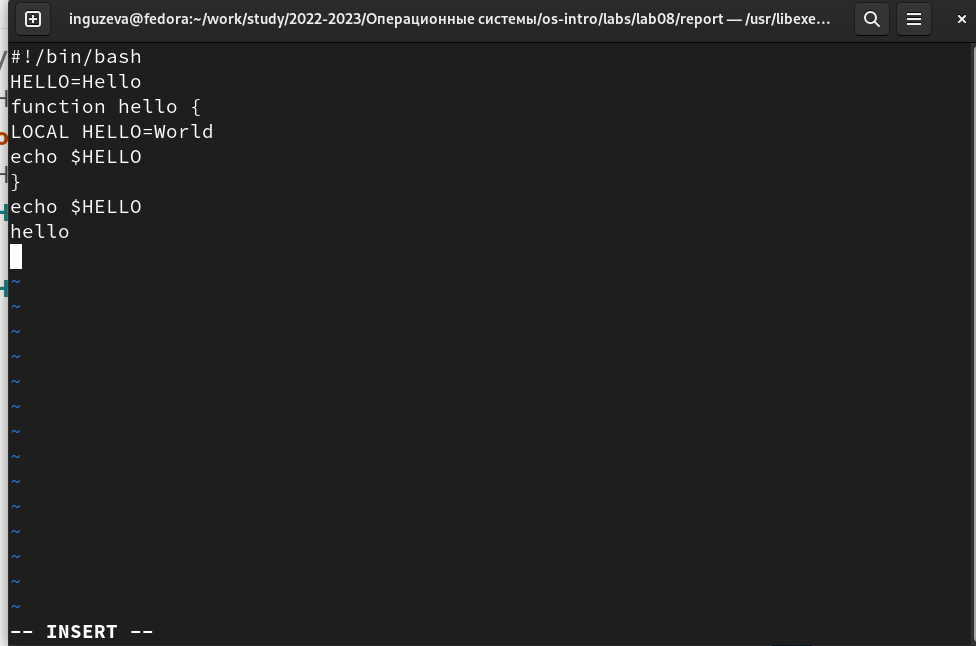
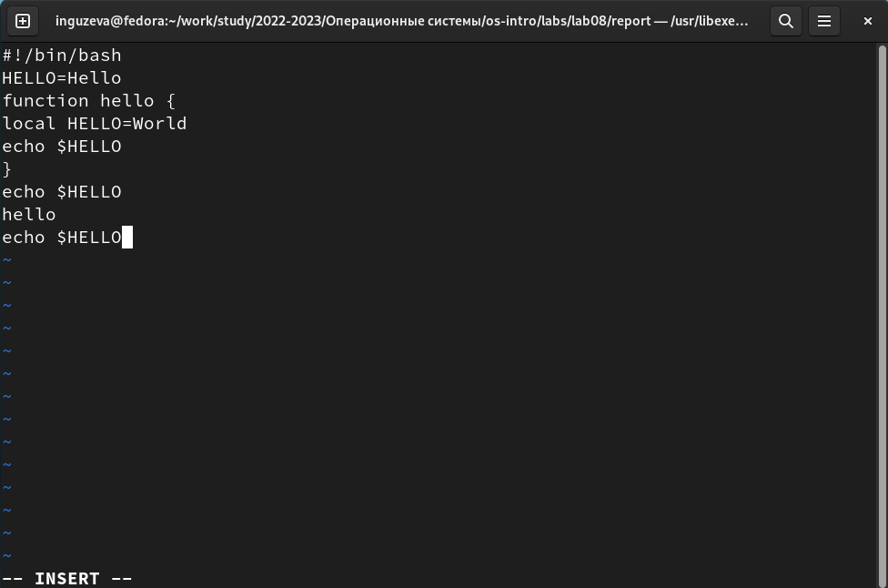

---
## Front matter
lang: ru-RU
title: Презентация №8
subtitle: "Текстовой редактор vi"
author:
  - Гузева Ирина Николаевна
institute:
  - Российский университет дружбы народов, Москва, Россия
  - Объединённый институт ядерных исследований, Дубна, Россия
date: 22 марта 2023

## i18n babel
babel-lang: russian
babel-otherlangs: english

## Formatting pdf
toc: false
toc-title: Содержание
slide_level: 2
aspectratio: 169
section-titles: true
theme: metropolis
header-includes:
 - \metroset{progressbar=frametitle,sectionpage=progressbar,numbering=fraction}
 - '\makeatletter'
 - '\beamer@ignorenonframefalse'
 - '\makeatother'
---

## Цель

Познакомиться с операционной системой Linux. Получить практические навыки работы с редактором vi, установленным по умолчанию практически во всех дистрибутивах.

## Выполнение лабораторной работы

1. Вызвала vi и создала файл hello.sh, нажала клавишу i и ввела данный в лабораторной текст. Нажала клавишу Esc для перехода в командный режим после завершения ввода
текста. Нажала : для перехода в режим последней строки и внизу экрана появилось
приглашение в виде двоеточия. Нажала w (записать) и q (выйти), а затем клавишу Enter для сохранения
текста и завершения работы.

{ #fig:001 width=40% }

## Команда chmod

2. Сделала файл исполняемым

{ #fig:002 width=70% }

## Вызов vi

3. Вызвала vi на редактирование файла

{ #fig:003 width=50% }

## Редактирование файла

4. Установила курсор в конец слова HELL второй строки. Перешла в режим
вставки и заменила на HELLO. Нажала Esc для возврата в командный режим.
Установила курсор на четвертую строку и стерла слово LOCAL. Перешла в
режим вставки и наберите следующий текст: local, нажмите Esc для возврата
в командный режим.

{ #fig:004 width=40% }

## Удаление последней строки

5. Установила курсор на последней строке файла. Вставила после неё строку,
содержащую следующий текст: echo $HELLO. Нажала Esc для перехода в
командный режим. Удалила последнюю строку.

{ #fig:005 width=40% }

## Выводы

В процессе выполнения лабораторной работы я познакомилась с операционной системой Linux. Получила практические навыки работы с редактором vi, установленным по умолчанию практически во всех дистрибутивах.

