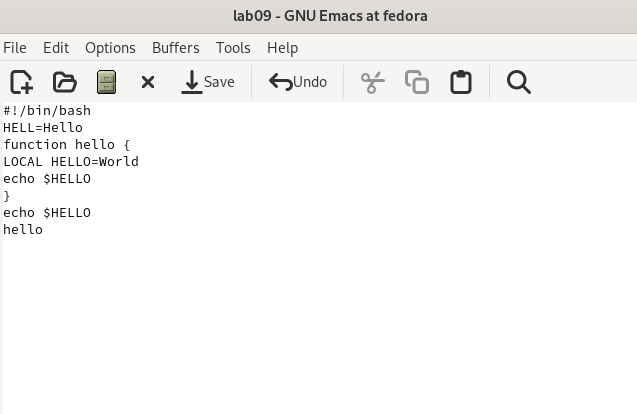
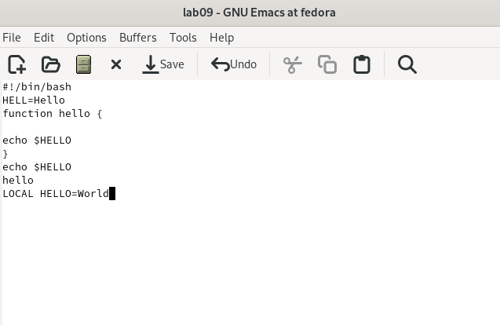
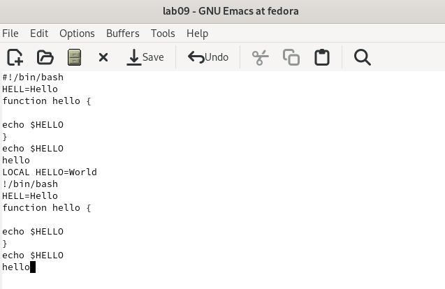
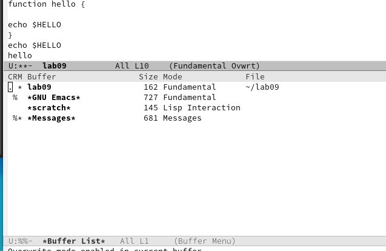
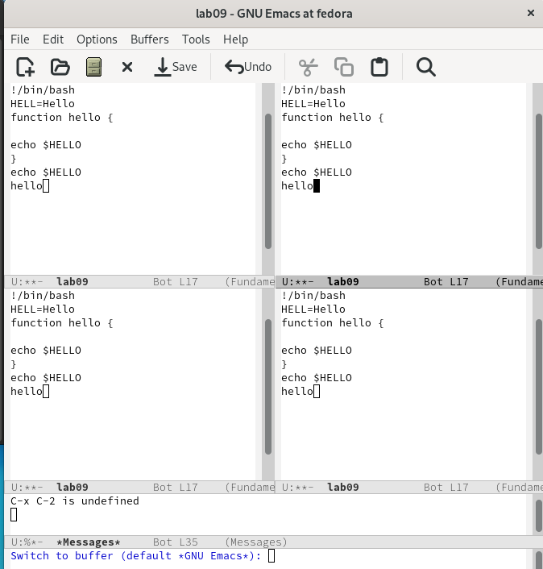
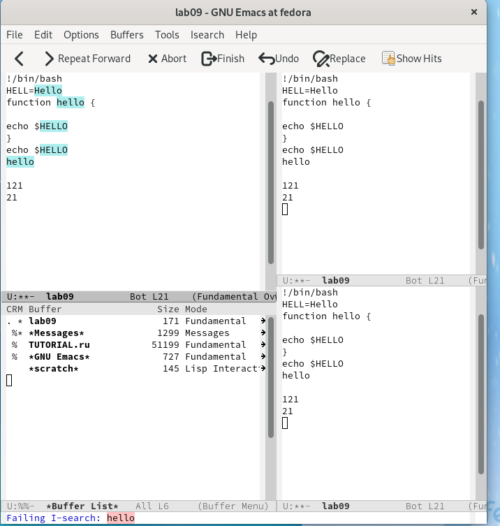

---
## Front matter
lang: ru-RU
title: Презентация №9
subtitle: "Текстовой редактор emacs"
author:
  - Гузева Ирина Николаевна
institute:
  - Российский университет дружбы народов, Москва, Россия
  - Объединённый институт ядерных исследований, Дубна, Россия
date: 22 марта 2023

## i18n babel
babel-lang: russian
babel-otherlangs: english

## Formatting pdf
toc: false
toc-title: Содержание
slide_level: 2
aspectratio: 169
section-titles: true
theme: metropolis
header-includes:
 - \metroset{progressbar=frametitle,sectionpage=progressbar,numbering=fraction}
 - '\makeatletter'
 - '\beamer@ignorenonframefalse'
 - '\makeatother'
---

## Цель

Познакомиться с операционной системой Linux. Получить практические навыки работы с редактором Emacs.

## Выполнение лабораторной работы

1. Открыла emacs. Создала файл lab09sh с помощью комбинации Ctrl-x Ctrl-f
(C-x C-f) Набрала данный текст. Сохранила файл с помощью комбинации
Ctrl-x Ctrl-s (C-x C-s)

{ #fig:001 width=40% }

## Удаление и вставка строки

2. Вырезала одной командой целую строку (С-k). Вставила эту строку в конец
файла (C-y)

{ #fig:002 width=70% }

## Работа с буфером обмена

3. Выделила область текста (C-space). Скопировала область в буфер обмена
(M-w). Вставила область в конец файла. Вновь выделила эту область и на
этот раз вырезала её (C-w). Отменила последнее действие (C-/).

{ #fig:003 width=50% }

## Перемещение курсора и просмотр буфера

4. Переместила курсор в начало строки (C-a). Переместила курсор в конец
8строки (C-e). Переместила курсор в начало буфера (M-<). Переместила кур-
сор в конец буфера (M->). Вывела список активных буферов на экран (C-x
C-b).
{ #fig:004 width=40% }

## Деление фрейма

5. Переместилась во вновь открытое окно (C-x) со списком открытых буферов
и переключилась на другой буфер. Закрыла это окно (C-x 0). Теперь вновь
переключилась между буферами, но уже без вывода их списка на экран (C-x
b). Поделила фрейм на 4 части: разделила фрейм на два окна по вертикали
(C-x 3), а затем каждое из этих окон на две части по горизонтали (C-x 2)

{ #fig:005 width=40% }

## Режим поиска

6. В каждом из четырёх созданных окон открыла новый буфер (файл) и введи-
те несколько строк текста. Переключилась в режим поиска (C-s) и нашла
несколько слов, присутствующих в тексте.Переключилась между результа-
тами поиска, нажимая C-s. Вышла из режима поиска, нажав C-g. Перешла
в режим поиска и замены (M-%), ввела текст, который следует найти и
заменить, нажала Enter, затем ввела текст для замены. Нажмите ! для под-
тверждения замены. Испробовала другой режим поиска, нажав M-s o.

{ #fig:005 width=40% }

## Выводы

В процессе выполнения лабораторной работы я получила практические навыки работы в редакторе Emacs.

