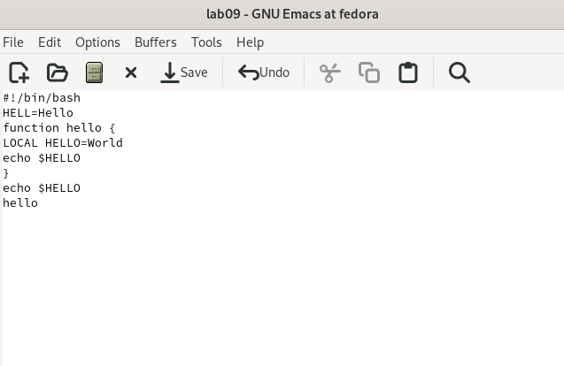
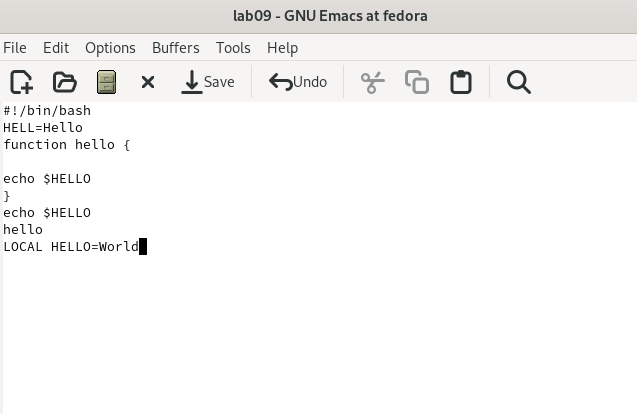
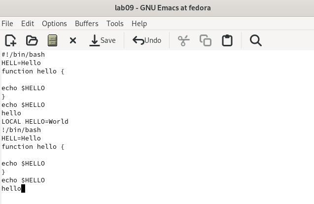
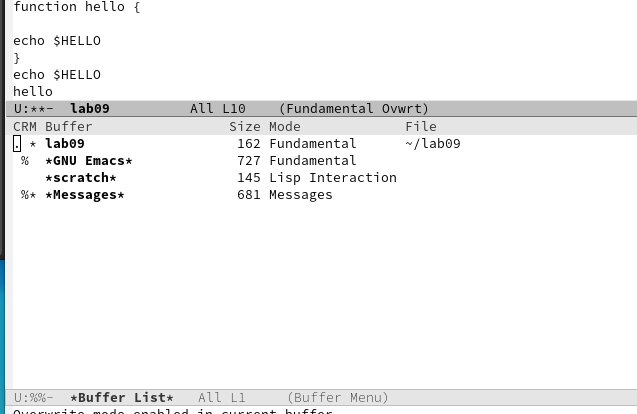
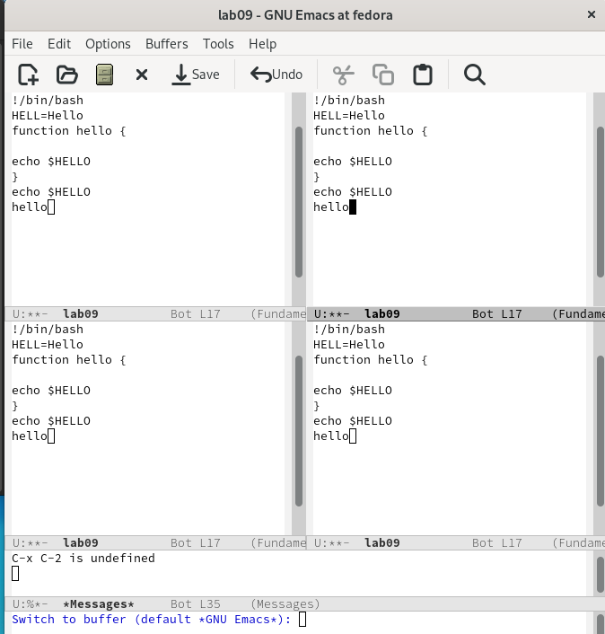
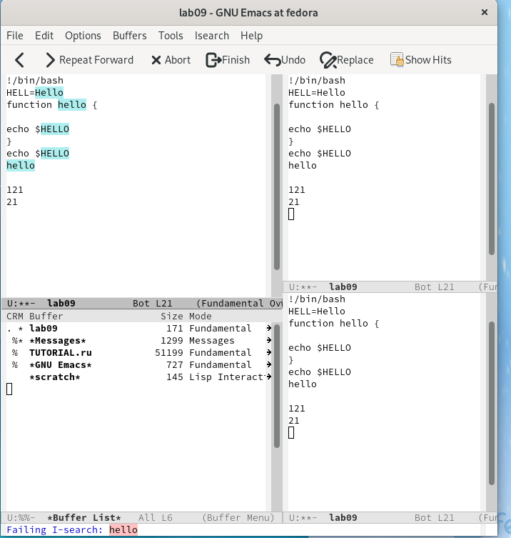

---
## Front matter
title: "Лабораторная работа №9"
subtitle: "Текстовой редактор emacs"
author: "Гузева Ирина Николаевна"

 ## Generic otions
lang: ru-RU

## Bibliography
bibliography: bib/cite.bib
csl: pandoc/csl/gost-r-7-0-5-2008-numeric.csl

## Pdf output format
toc: true # Table of contents
toc-depth: 2
lof: true # List of figures
lot: true # List of tables
fontsize: 12pt
linestretch: 1.5
papersize: a4
documentclass: scrreprt
## I18n polyglossia
polyglossia-lang:
  name: russian
  options:
	- spelling=modern
	- babelshorthands=true
polyglossia-otherlangs:
  name: english
## I18n babel
babel-lang: russian
babel-otherlangs: english
## Fonts
mainfont: PT Serif
romanfont: PT Serif
sansfont: PT Sans
monofont: PT Mono
mainfontoptions: Ligatures=TeX
romanfontoptions: Ligatures=TeX
sansfontoptions: Ligatures=TeX,Scale=MatchLowercase
monofontoptions: Scale=MatchLowercase,Scale=0.9
## Biblatex
biblatex: true
biblio-style: "gost-numeric"
biblatexoptions:
  - parentracker=true
  - backend=biber
  - hyperref=auto
  - language=auto
  - autolang=other*
  - citestyle=gost-numeric
## Pandoc-crossref LaTeX customization

## Misc options
indent: true
header-includes:
  - \usepackage{indentfirst}
  - \usepackage{float} # keep figures where there are in the text
  - \floatplacement{figure}{H} # keep figures where there are in the text
---

# Цель работы

Познакомиться с операционной системой Linux. Получить практические навыки работы с редактором Emacs.

# Теоретическое введение

Emacs — один из наиболее мощных и широко распространённых редакторов, используемых в мире UNIX. По популярности он соперничает с редактором vi и его клонами. В зависимости от ситуации, Emacs может быть:
•	текстовым редактором;
•	программой для чтения почты и новостей Usenet;
•	интегрированной средой разработки (IDE);
•	операционной системой;
Всё это разнообразие достигается благодаря архитектуре Emacs, которая позволяет расширять возможности редактора при помощи языка Emacs Lisp. На языке C написаны лишь самые базовые и низкоуровневые части Emacs, включая полнофункциональный интерпретатор языка Lisp. Таким образом, Emacs имеет встроенный язык программирования, который может использоваться для настройки, расширения и изменения поведения редактора. В действительности, большая часть того редактора, с которым пользователи Emacs работают в наши дни, написана на языке Lisp.
Первая версия редактора Emacs была написана в 70-х годах 20-го столетия Richard Stallman (Ричардом Столманом) как набор макросов для редактора TECO . В дальнейшем, уже будучи основателем Фонда Свободного программного обеспечения Free Software Foundation и проекта GNU, Stallman разработал GNU Emacs в развитие оригинального Emacs и до сих пор сопровождает эту программу. Emacs является одним из старейших редакторов. Он использовался тысячами программистов на протяжении последних 20 с лишним лет, для него создано много дополнительных пакетов расширений. Эти дополнения позволяют делать с помощью Emacs такие вещи, которые Stallman , вероятно, даже не считал возможными в начале своей работы над редактором. [1]

# Выполнение лабораторной работы

1) Открыла emacs. Создала файл lab09sh с помощью комбинации Ctrl-x Ctrl-f (C-x C-f) Набрала данный текст. Сохранила файл с помощью комбинации Ctrl-x Ctrl-s (C-x C-s) (рис. [-@fig:001])

{ #fig:001 width=70% }

2) Вырезала одной командой целую строку (С-k). Вставила эту строку в конец файла (C-y). (рис. [-@fig:002])

{ #fig:002 width=70% }

3) Выделила область текста (C-space). Скопировала область в буфер обмена (M-w). Вставила область в конец файла. Вновь выделила эту область и на этот раз вырезала её (C-w). Отменила последнее действие (C-/). (рис. [-@fig:003])

{ #fig:003 width=70% }

4) Переместила курсор в начало строки (C-a). Переместила курсор в конец строки (C-e). Переместила курсор в начало буфера (M-<). Переместила курсор в конец буфера (M->). Вывела список активных буферов на экран (C-x C-b). (рис. [-@fig:004]) 

{ #fig:004 width=70% }

5) Переместилась во вновь открытое окно (C-x) со списком открытых буферов
и переключилась на другой буфер. Закрыла это окно (C-x 0). Теперь вновь переключилась между буферами, но уже без вывода их списка на экран (C-x b). Поделила фрейм на 4 части: разделила фрейм на два окна по вертикали (C-x 3),
а затем каждое из этих окон на две части по горизонтали (C-x 2) (рис. [-@fig:005])

{ #fig:005 width=70% }

6) В каждом из четырёх созданных окон открыла новый буфер (файл) и введите несколько строк текста. Переключилась в режим поиска (C-s) и нашла несколько слов, присутствующих в тексте.Переключилась между результатами поиска, нажимая C-s. Вышла из режима поиска, нажав C-g. Перешла в режим поиска и замены (M-%), ввела текст, который следует найти и заменить, нажала Enter, затем ввела текст для замены. Нажмите ! для подтверждения замены. Испробовала другой режим поиска, нажав M-s o. (рис. [-@fig:006])

{ #fig:006 width=70% }

# Вывод

В процессе выполнения лабораторной работы я получила практические навыки работы в редакторе Emacs.

# Контрольные вопросы

1.	Кратко охарактеризуйте редактор emacs.
Emacs — один из наиболее мощных и широко распространённых редакторов, используемых в мире UNIX. Написан на языке высокого уровня Lisp.
2.	Какие особенности данного редактора могут сделать его сложным для освоения новичком?
Большое разнообразие сложных комбинаций клавиш, которые необходимы для редактирования файла и в принципе для работа с Emacs.
3.	Своими словами опишите, что такое буфер и окно в терминологии emacs’а.
Буфер - это объект в виде текста. Окно - это прямоугольная область, в которой отображен буфер.
4.	Можно ли открыть больше 10 буферов в одном окне?
Да, можно.
5.	Какие буферы создаются по умолчанию при запуске emacs?
Emacs использует буферы с именами, начинающимися с пробела, для внутренних целей. Отчасти он обращается с буферами с такими именами особенным образом – например, по умолчанию в них не записывается информация для отмены изменений.
6.	Какие клавиши вы нажмёте, чтобы ввести следующую комбинацию C-c | и C-c C-|?
Ctrl + c, а потом | и Ctrl + c Ctrl + |
7.	Как поделить текущее окно на две части?
С помощью команды Ctrl + x 3 (по вертикали) и Ctrl + x 2 (по горизонтали).
8.	В каком файле хранятся настройки редактора emacs?
Настройки emacs хранятся в файле . emacs, который хранится в домашней дирректории пользователя. Кроме этого файла есть ещё папка . emacs.
9.	Какую функцию выполняет клавиша и можно ли её переназначить?
Выполняет фугкцию стереть, думаю можно переназначить.
10.	Какой редактор вам показался удобнее в работе vi или emacs? Поясните почему.
Для меня удобнее был редактор Emacs, так как у него есть командая оболочка. А vi открывается в терминале, и выглядит своеобразно.

