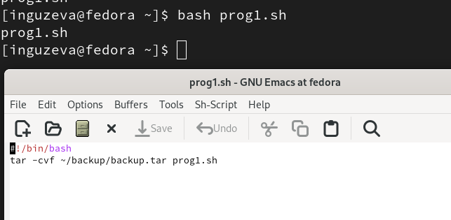
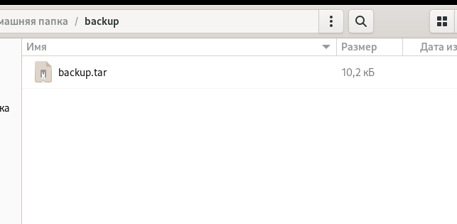
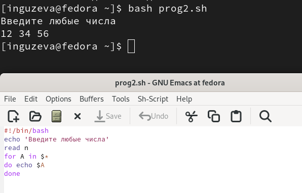
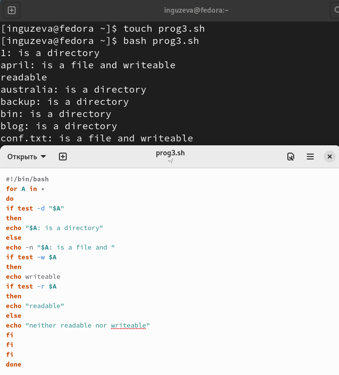
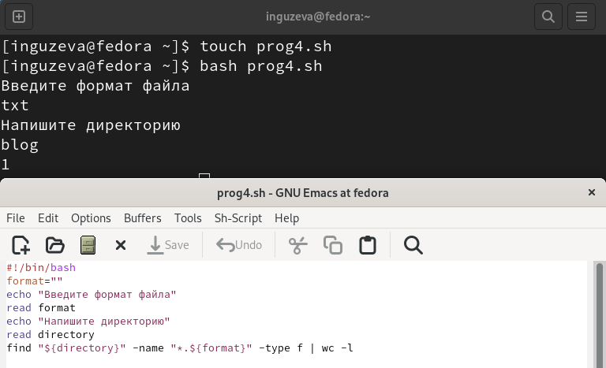

---
## Front matter
lang: ru-RU
title: Презентация №10
subtitle: "Программирование в командном процессоре ОС UNIX. Командные
файлы"
author:
  - Гузева Ирина Николаевна
institute:
  - Российский университет дружбы народов, Москва, Россия
  - Объединённый институт ядерных исследований, Дубна, Россия
date: 22 марта 2023

## i18n babel
babel-lang: russian
babel-otherlangs: english

## Formatting pdf
toc: false
toc-title: Содержание
slide_level: 2
aspectratio: 169
section-titles: true
theme: metropolis
header-includes:
 - \metroset{progressbar=frametitle,sectionpage=progressbar,numbering=fraction}
 - '\makeatletter'
 - '\beamer@ignorenonframefalse'
 - '\makeatother'
---

## Цель

Изучить основы программирования в оболочке ОС UNIX/Linux. Научиться
писать небольшие командные файлы.

## Выполнение лабораторной работы

1. Написала скрипт, который при запуске будет делать резервную копию само-
го себя (то есть файла, в котором содержится его исходный код) в другую
директорию backup в домашнем каталоге. При этом файл должен архиви-
роваться одним из архиваторов на выбор zip, bzip2 или tar

{ #fig:001 width=40% }

## Командный файл №1

2. Можно увидеть, что программа сработала правильно

{ #fig:002 width=70% }

## Командный файл №2

3. Написала пример командного файла, обрабатывающего любое произволь-
ное число аргументов командной строки, в том числе превышающее десять.
Скрипт может последовательно распечатывает значения всех переданных
аргументов.

{ #fig:003 width=50% }

## Командный файл №3

4. Написать командный файл — аналог команды ls (без использования самой
этой команды и команды dir). Он выдает информацию о нужном каталоге и выводит информацию о возможностях доступа к файлам этого каталога.

{ #fig:004 width=40% }

## Командный файл №4

5. Написала командный файл, который получает в качестве аргумента команд-
ной строки формат файла (.txt, .doc, .jpg, .pdf и т.д.) и вычисляет количество
таких файлов в указанной директории. Путь к директории также передаётся
в виде аргумента командной строки.

{ #fig:005 width=40% }

## Выводы

В процессе выполнения лабораторной работы я изучила основы программи-
рования в оболочке ОС UNIX/Linux. Научилась писать небольшие командные
файлы.
