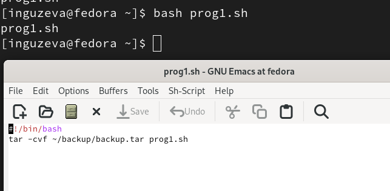
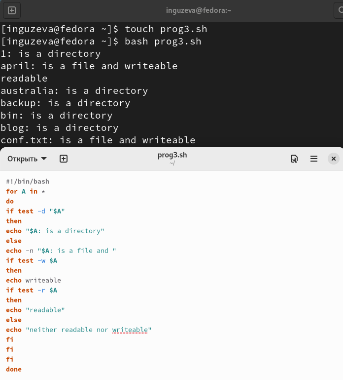

---
## Front matter
title: "Лабораторная работа №10"
subtitle: "Программирование в командном процессоре ОС UNIX. Командные файлы"
author: "Гузева Ирина Николаевна"

 ## Generic otions
lang: ru-RU

## Bibliography
bibliography: bib/cite.bib
csl: pandoc/csl/gost-r-7-0-5-2008-numeric.csl

## Pdf output format
toc: true # Table of contents
toc-depth: 2
lof: true # List of figures
lot: true # List of tables
fontsize: 12pt
linestretch: 1.5
papersize: a4
documentclass: scrreprt
## I18n polyglossia
polyglossia-lang:
  name: russian
  options:
	- spelling=modern
	- babelshorthands=true
polyglossia-otherlangs:
  name: english
## I18n babel
babel-lang: russian
babel-otherlangs: english
## Fonts
mainfont: PT Serif
romanfont: PT Serif
sansfont: PT Sans
monofont: PT Mono
mainfontoptions: Ligatures=TeX
romanfontoptions: Ligatures=TeX
sansfontoptions: Ligatures=TeX,Scale=MatchLowercase
monofontoptions: Scale=MatchLowercase,Scale=0.9
## Biblatex
biblatex: true
biblio-style: "gost-numeric"
biblatexoptions:
  - parentracker=true
  - backend=biber
  - hyperref=auto
  - language=auto
  - autolang=other*
  - citestyle=gost-numeric
## Pandoc-crossref LaTeX customization

## Misc options
indent: true
header-includes:
  - \usepackage{indentfirst}
  - \usepackage{float} # keep figures where there are in the text
  - \floatplacement{figure}{H} # keep figures where there are in the text
---

# Цель работы

Изучить основы программирования в оболочке ОС UNIX/Linux. Научиться писать небольшие командные файлы.

# Теоретическое введение

Командный процессор (командная оболочка, интерпретатор команд shell) — это программа, позволяющая пользователю взаимодействовать с операционной системой компьютера. В операционных системах типа UNIX/Linux наиболее часто используются следующие реализации командных оболочек: - оболочка Борна (Bourne shell или sh) — стандартная командная оболочка UNIX/Linux, содержащая базовый, но при этом полный набор функций;
•	С-оболочка (или csh) — надстройка на оболочкой Борна, использующая С-подобный синтаксис команд с возможностью сохранения истории выполнения команд;
•	оболочка Корна (или ksh) — напоминает оболочку С, но операторы управления программой совместимы с операторами оболочки Борна;
•	BASH — сокращение от Bourne Again Shell (опять оболочка Борна), в основе своей совмещает свойства оболочек С и Корна (разработка компании Free Software Foundation).
POSIX (Portable Operating System Interface for Computer Environments) — набор стандартов описания интерфейсов взаимодействия операционной системы и прикладных программ. Стандарты POSIX разработаны комитетом IEEE (Institute of Electrical and Electronics Engineers) для обеспечения совместимости различных UNIX/Linux-подобных операционных систем и переносимости прикладных программ на уровне исходного кода. POSIX-совместимые оболочки разработаны на базе оболочки Корна. Рассмотрим основные элементы программирования в оболочке bash. В других оболочках большинство команд будет совпадать с описанными ниже. 

# Выполнение лабораторной работы

1) Написаkf скрипт, который при запуске будет делать резервную копию самого себя (то
есть файла, в котором содержится его исходный код) в другую директорию backup
в домашнем каталоге. При этом файл должен архивироваться одним из архиваторов на выбор zip, bzip2 или tar (рис. [-@fig:001])

{ #fig:001 width=70% }

2) Можно увидеть, что программа сработала правильно (рис. [-@fig:002])

{ #fig:002 width=70% }

3) Написала пример командного файла, обрабатывающего любое произвольное число
аргументов командной строки, в том числе превышающее десять. Скрипт
может последовательно распечатывает значения всех переданных аргументов. (рис. [-@fig:003])

{ #fig:003 width=70% }

4) Написать командный файл — аналог команды ls (без использования самой этой команды и команды dir). Он выдает информацию о нужном каталоге и выводит информацию о возможностях доступа к файлам этого каталога.  (рис. [-@fig:004]) 

{ #fig:004 width=70% }

5) Написала командный файл, который получает в качестве аргумента командной строки
формат файла (.txt, .doc, .jpg, .pdf и т.д.) и вычисляет количество таких файлов
в указанной директории. Путь к директории также передаётся в виде аргумента командной строки. (рис. [-@fig:005])

{ #fig:005 width=70% }

# Вывод

В процессе выполнения лабораторной работы я изучила основы программирования в оболочке ОС UNIX/Linux. Научилась писать небольшие командные файлы.

