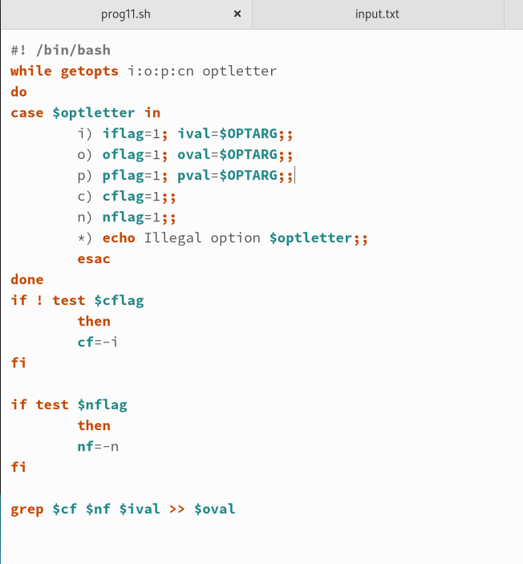
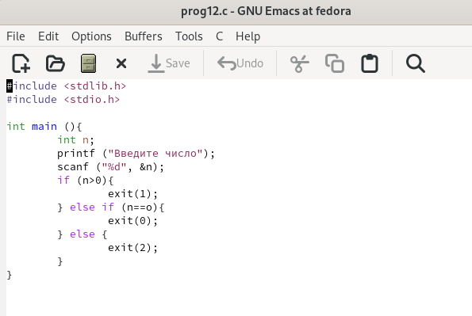
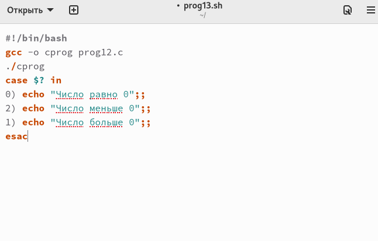
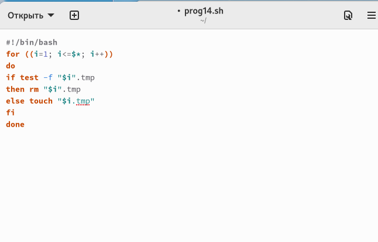
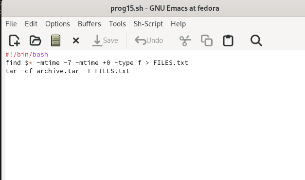

---
## Front matter
lang: ru-RU
title: Презентация №11
subtitle: "Программирование в командном процессоре ОС UNIX. Ветвление и циклы"
author:
  - Гузева Ирина Николаевна
institute:
  - Российский университет дружбы народов, Москва, Россия
  - Объединённый институт ядерных исследований, Дубна, Россия
date: 22 марта 2023

## i18n babel
babel-lang: russian
babel-otherlangs: english

## Formatting pdf
toc: false
toc-title: Содержание
slide_level: 2
aspectratio: 169
section-titles: true
theme: metropolis
header-includes:
 - \metroset{progressbar=frametitle,sectionpage=progressbar,numbering=fraction}
 - '\makeatletter'
 - '\beamer@ignorenonframefalse'
 - '\makeatother'
---

## Цель

Изучить основы программирования в оболочке ОС UNIX. Научится писать
более сложные командные файлы с использованием логических управляющих
конструкций и циклов.

## Выполнение лабораторной работы

1. Используя команды getopts grep, написала командный файл, который ана-
лизирует командную строку с ключами: – -iinputfile — прочитать данные
из указанного файла; – -ooutputfile — вывести данные в указанный файл; –
-p шаблон — указать шаблон для поиска; – -C — различать большие и малые
буквы; – -n — выдавать номера строк. а затем ищет в указанном файле
нужные строки, определяемые ключом -p

{ #fig:001 width=40% }

## Программа №1

2. Можно увидеть, что программа сработала правильно

{ #fig:002 width=70% }

## Программа №2

3. Написала на языке Си программу, которая вводит число и определяет, явля-
ется ли оно больше нуля, меньше нуля или равно нулю. Затем программа
завершается с помощью функции exit(n), передавая информацию в о коде
завершения в оболочку. Командный файл должен вызывать эту программу
и, проанализировав с помощью команды $?, выдать сообщение о том, какое
число было введено.

{ #fig:003 width=50% }

## Программа №3

4. Написала командный файл, создающий указанное число файлов, пронуме-
рованных последовательно от 1 до n (например 1.tmp, 2.tmp, 3.tmp,4.tmp и
т.д.). Число файлов, которые необходимо создать, передаётся в аргументы
командной строки. Этот же командный файл должен уметь удалять все
созданные им файлы (если они существуют).

{ #fig:004 width=40% }

## Программа №4

5. Написала командный файл, который с помощью команды tar запаковывает
в архив все файлы в указанной директории. Модифицировать его так, чтобы
запаковывались только те файлы, которые были изменены менее недели
тому назад (использовать команду find)

{ #fig:005 width=40% }

## Выводы

В процессе выполнения данной лабораторной работы я изучила основы про-
граммирования в оболочке ОС UNIX. Научилась писать более сложные командные
файлы с использованием логических управляющих конструкций и циклов.

