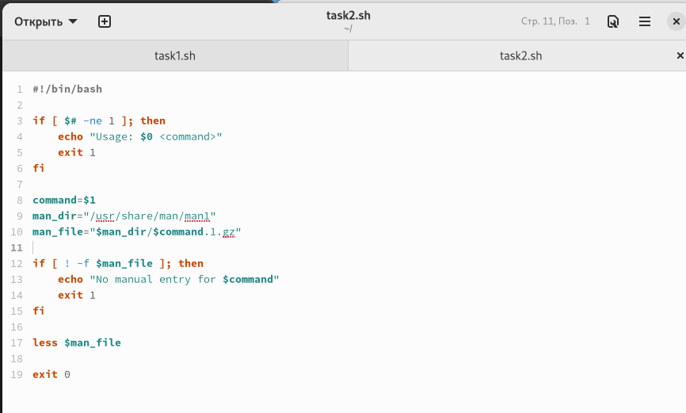
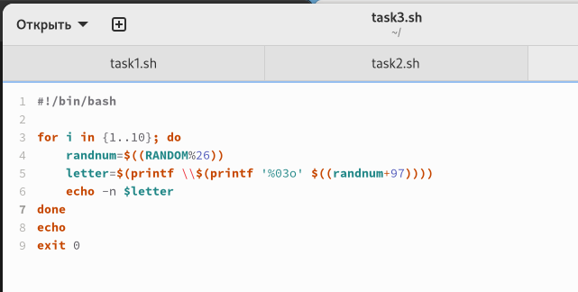

---
## Front matter
lang: ru-RU
title: Презентация №12
subtitle: "Программирование в командном процессоре ОС UNIX. Расширенное программирование"
author:
  - Гузева Ирина Николаевна
institute:
  - Российский университет дружбы народов, Москва, Россия
  - Объединённый институт ядерных исследований, Дубна, Россия
date: 22 марта 2023

## i18n babel
babel-lang: russian
babel-otherlangs: english

## Formatting pdf
toc: false
toc-title: Содержание
slide_level: 2
aspectratio: 169
section-titles: true
theme: metropolis
header-includes:
 - \metroset{progressbar=frametitle,sectionpage=progressbar,numbering=fraction}
 - '\makeatletter'
 - '\beamer@ignorenonframefalse'
 - '\makeatother'
---

## Цель

Изучить основы программирования в оболочке ОС UNIX. Научиться писать более сложные командные файлы с использованием логических управляющих конструкций и циклов.

## Выполнение лабораторной работы

1. Написать командный файл, реализующий упрощённый механизм семафо-
ров. Командный файл должен в течение некоторого времени t1 дожидаться
освобождения ресурса, выдавая об этом сообщение, а дождавшись его осво-
бождения, использовать его в течение некоторого времени t2<>t1, также
выдавая информацию о том, что ресурс используется соответствующим
командным файлом (процессом). Запустить командный файл в одном вир-
туальном терминале в фоновом режиме, перенаправив его вывод в другой (>
/dev/tty#, где # — номер терминала куда перенаправляется вывод), в котором
также запущен этот файл, но не фоновом, а в привилегированном режиме.
Доработать программу так, чтобы имелась возможность взаимодействия
трёх и более процессов.

## Программа №1

{ #fig:001 width=40% }

## Программа №2

2. Реализовать команду man с помощью командного файла. Изучите содер-
жимое каталога /usr/share/man/man1. В нем находятся архивы текстовых
файлов, содержащих справку по большинству установленных в системе
программ и команд. Каждый архив можно открыть командой less сразу
же просмотрев содержимое справки. Командный файл должен получать в
виде аргумента командной строки название команды и в виде результата
выдавать справку об этой команде или сообщение об отсутствии справки,
если соответствующего файла нет в каталоге man1.

## Программа №2

{ #fig:002 width=50% }

## Программа №3

3. Используя встроенную переменную $RANDOM, напишите командный файл,
генерирующий случайную последовательность букв латинского алфавита.
Учтите, что $RANDOM выдаёт псевдослучайные числа в диапазоне от 0 до
32767.

{ #fig:003 width=40% }

## Выводы

В процессе выполнения этой лабораторной работы я продолжила осваивать программирование на bash.

