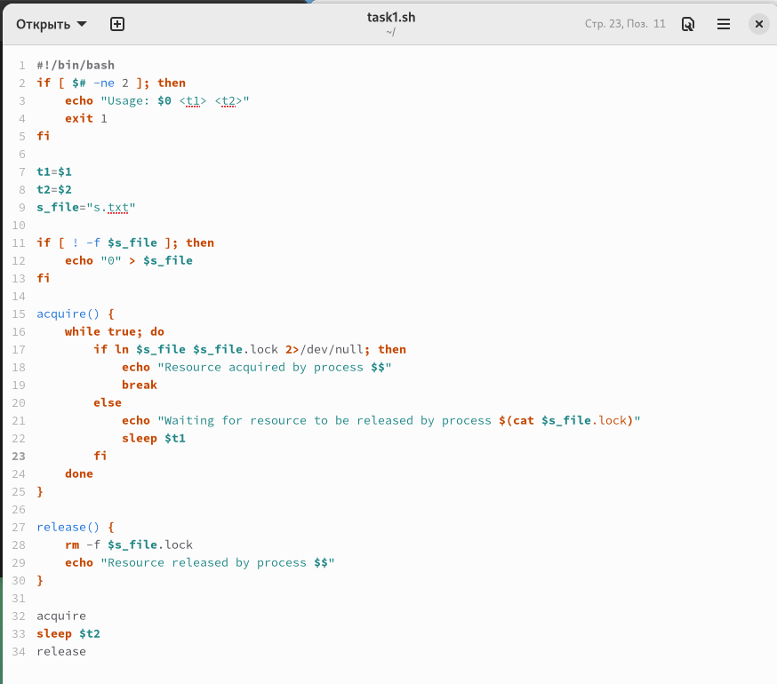
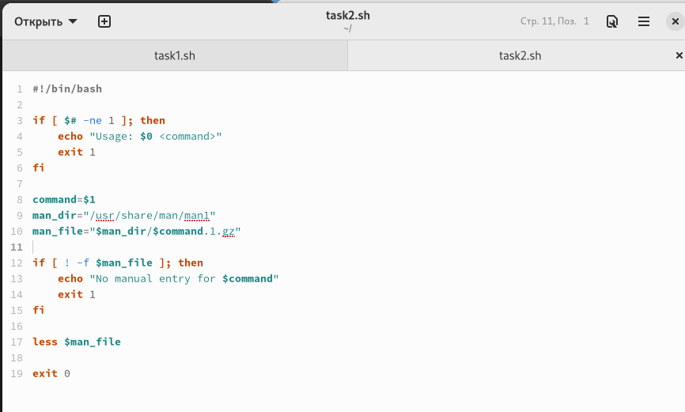
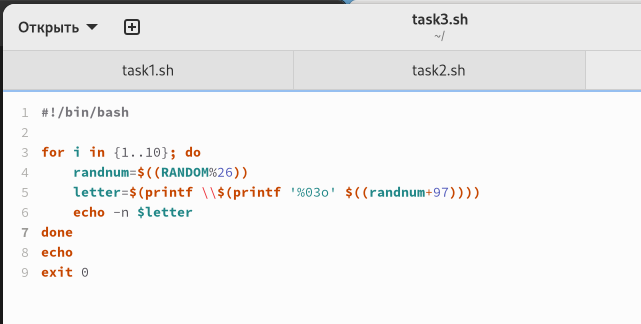

---
## Front matter
title: "Лабораторная работа №12"
subtitle: "Программирование в командном процессоре ОС UNIX. Расширенное программирование"
author: "Гузева Ирина Николаевна"

 ## Generic otions
lang: ru-RU

## Bibliography
bibliography: bib/cite.bib
csl: pandoc/csl/gost-r-7-0-5-2008-numeric.csl

## Pdf output format
toc: true # Table of contents
toc-depth: 2
lof: true # List of figures
lot: true # List of tables
fontsize: 12pt
linestretch: 1.5
papersize: a4
documentclass: scrreprt
## I18n polyglossia
polyglossia-lang:
  name: russian
  options:
	- spelling=modern
	- babelshorthands=true
polyglossia-otherlangs:
  name: english
## I18n babel
babel-lang: russian
babel-otherlangs: english
## Fonts
mainfont: PT Serif
romanfont: PT Serif
sansfont: PT Sans
monofont: PT Mono
mainfontoptions: Ligatures=TeX
romanfontoptions: Ligatures=TeX
sansfontoptions: Ligatures=TeX,Scale=MatchLowercase
monofontoptions: Scale=MatchLowercase,Scale=0.9
## Biblatex
biblatex: true
biblio-style: "gost-numeric"
biblatexoptions:
  - parentracker=true
  - backend=biber
  - hyperref=auto
  - language=auto
  - autolang=other*
  - citestyle=gost-numeric
## Pandoc-crossref LaTeX customization

## Misc options
indent: true
header-includes:
  - \usepackage{indentfirst}
  - \usepackage{float} # keep figures where there are in the text
  - \floatplacement{figure}{H} # keep figures where there are in the text
---

# Цель работы

Изучить основы программирования в оболочке ОС UNIX. Научиться писать более сложные командные файлы с использованием логических управляющих конструкций и циклов.

# Теоретическое введение

Командный процессор (командная оболочка, интерпретатор команд shell) — это программа, позволяющая пользователю взаимодействовать с операционной системой компьютера. В операционных системах типа UNIX/Linux наиболее часто используются следующие реализации командных оболочек: – оболочка Борна (Bourne shell или sh) — стандартная командная оболочка UNIX/Linux, содержащая базовый, но при этом полный набор функций; – С-оболочка (или csh) — надстройка на оболочкой Борна, использующая С-подобный синтаксис команд с возможностью сохранения истории выполнения команд; – оболочка Корна (или ksh) — напоминает оболочку С, но операторы управления программой совместимы с операторами оболочки Борна; – BASH — сокращение от Bourne Again Shell (опять оболочка Борна), в основе своей совмещает свойства оболочек С и Корна (разработка компании Free Software Foundation). POSIX (Portable Operating System Interface for Computer Environments) — набор стандартов описания интерфейсов взаимодействия операционной системы и прикладных программ. Стандарты POSIX разработаны комитетом IEEE (Institute of Electrical and Electronics Engineers) для обеспечения совместимости различных UNIX/Linux-подобных операционных систем и переносимости прикладных программ на уровне исходного кода. POSIX-совместимые оболочки разработаны на базе оболочки Корна.

# Выполнение лабораторной работы

1) Написать командный файл, реализующий упрощённый механизм семафоров. Командный файл должен в течение некоторого времени t1 дожидаться освобождения
ресурса, выдавая об этом сообщение, а дождавшись его освобождения, использовать
его в течение некоторого времени t2<>t1, также выдавая информацию о том, что
ресурс используется соответствующим командным файлом (процессом). Запустить
командный файл в одном виртуальном терминале в фоновом режиме, перенаправив
его вывод в другой (> /dev/tty#, где # — номер терминала куда перенаправляется
вывод), в котором также запущен этот файл, но не фоновом, а в привилегированном
режиме. Доработать программу так, чтобы имелась возможность взаимодействия трёх
и более процессов. (рис. [-@fig:001])

{ #fig:001 width=70% }

2) Реализовать команду man с помощью командного файла. Изучите содержимое каталога /usr/share/man/man1. В нем находятся архивы текстовых файлов, содержащих
справку по большинству установленных в системе программ и команд. Каждый архив
можно открыть командой less сразу же просмотрев содержимое справки. Командный
файл должен получать в виде аргумента командной строки название команды и в виде
результата выдавать справку об этой команде или сообщение об отсутствии справки,
если соответствующего файла нет в каталоге man1. (рис. [-@fig:002])

{ #fig:002 width=70% }

3) Используя встроенную переменную $RANDOM, напишите командный файл, генерирующий случайную последовательность букв латинского алфавита. Учтите, что $RANDOM
выдаёт псевдослучайные числа в диапазоне от 0 до 32767. (рис. [-@fig:003]) 

{ #fig:003 width=70% }

# Вывод

В процессе выполнения этой лабораторной работы я продолжила осваивать программирование на bash.

# Контрольные вопросы

1. Синтаксическая ошибка в этой строке заключается в том, что необходимо добавить пробелы после открывающей и перед закрывающей скобками. Правильно будет:

while  $1 != "exit"
2. Для объединения (конкатенации) нескольких строк в одну на языке bash можно использовать оператор конкатенации строк "=". Например:

string1="Hello"
string2="World"
result=$string1$string2
echo $result

В результате выполнения скрипта будет выведено "HelloWorld". Также можно использовать двойные кавычки для объединения строк:

string1="Hello"
string2="World"
result="$string1$string2"
echo $result

Результат выполнения будет таким же.
3. Утилита seq используется для генерации последовательностей чисел. Она принимает три аргумента: начальное значение, конечное значение и шаг. Например, команда "seq 1 5" выведет последовательность чисел от 1 до 5.

В bash можно использовать циклы для генерации последовательностей чисел. Например, следующий код выведет последовательность чисел от 1 до 5:

for i in {1..5}
do
  echo $i
done

Также можно использовать команду "echo" в сочетании с командой "seq" для вывода последовательности чисел. Например, следующий код выведет последовательность чисел от 1 до 5:

echo $(seq 1 5)
4. Результатом вычисления выражения $((10/3)) на языке bash будет число 3. Это происходит потому, что операция деления в bash возвращает целочисленный результат, который округляется в сторону нуля. В данном случае, результат деления 10 на 3 равен 3 с остатком 1, но возвращается только целая часть - 3.
5. Z shell (zsh) отличается от bash более продвинутым и удобным интерфейсом командной строки, более широким набором опций и функций, гибкой системой настройки и расширения, а также возможностью использования ассоциативных массивов. Однако zsh может быть более медленной при работе с большими скриптами или сложными задачами.
6. Да, синтаксис данной конструкции верен для языка bash. Она используется для создания цикла for, который будет выполняться от 1 до значения переменной LIMIT, увеличивая переменную a на 1 на каждой итерации.
7. Язык bash относится к семейству языков командной оболочки и используется для автоматизации задач в операционных системах Linux и macOS. Он имеет свои преимущества и недостатки по сравнению с другими языками программирования.

Преимущества bash:

1. Простота использования. Bash является довольно простым языком программирования, который не требует особой подготовки и обучения.

2. Наличие большого количества утилит и команд, которые могут быть использованы для автоматизации задач.

3. Большое сообщество пользователей и разработчиков, которые создают и делятся своими скриптами и решениями.

4. Быстрота выполнения скриптов.

Недостатки bash:

1. Ограниченные возможности по сравнению с другими языками программирования, такими как Python или Java.

2. Неудобство при работе с большими объемами данных.

3. Низкая производительность при выполнении сложных математических операций.

4. Необходимость использования специальных символов для обозначения переменных и выполнения команд.

5. Не подходит для разработки крупных проектов из-за отсутствия поддержки объектно-ориентированного программирования.

6. Ограниченная переносимость между операционными системами, так как bash скрипты могут содержать команды, которые работают только в определенной операционной системе.

7. Недостаточная безопасность при работе с конфиденциальными данными, так как bash скрипты могут быть прочитаны и изменены любым пользователем, имеющим доступ к файлам системы.
