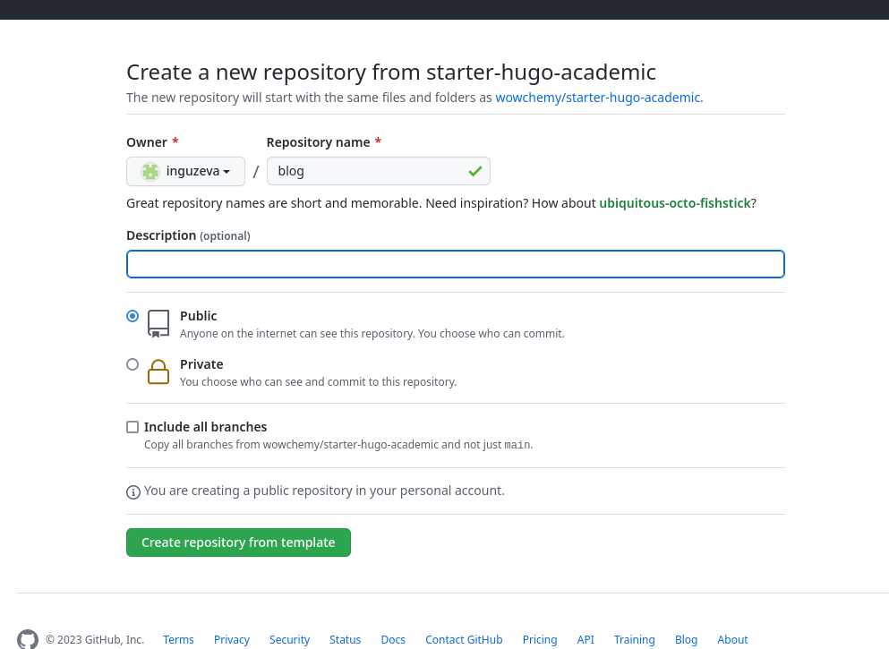
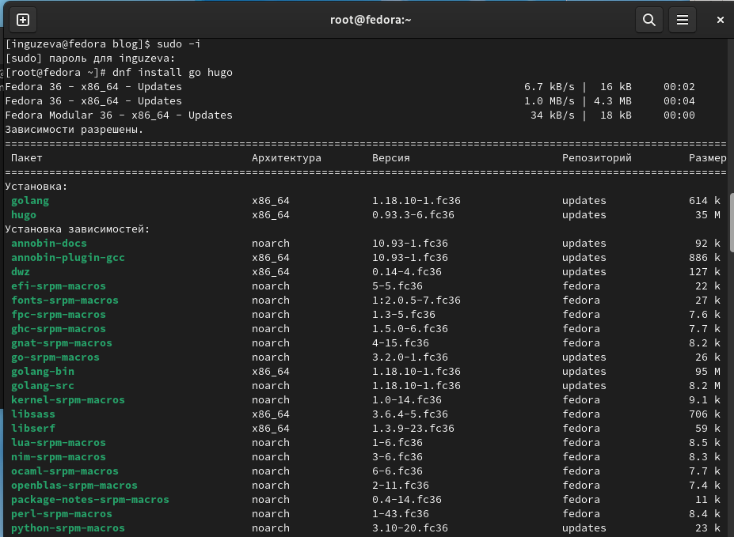
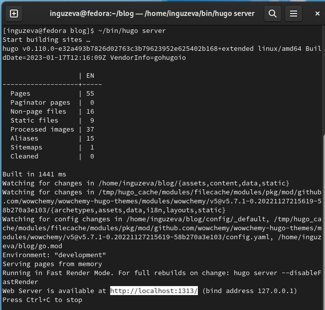
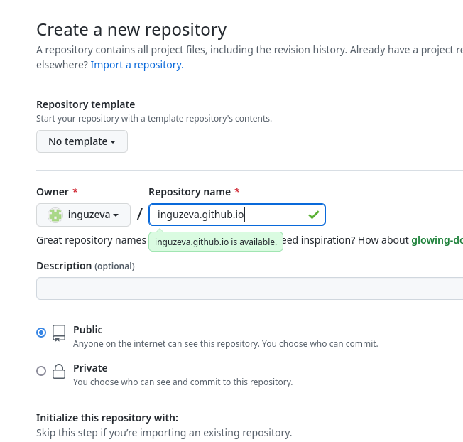
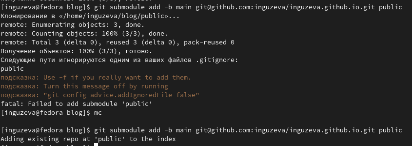

---
## Front matter
lang: ru-RU
title: Индивидуальный проект. Этап №1
subtitle: Размещение на Github pages заготовки для персонального сайта.
author:
  - Гузева Ирина Николаевна.
institute:
  - Российский университет дружбы народов, Москва, Россия
  - Объединённый институт ядерных исследований, Дубна, Россия
date: 23 февраля 2023

## i18n babel
babel-lang: russian
babel-otherlangs: english

## Formatting pdf
toc: false
toc-title: Содержание
slide_level: 2
aspectratio: 169
section-titles: true
theme: metropolis
header-includes:
 - \metroset{progressbar=frametitle,sectionpage=progressbar,numbering=fraction}
 - '\makeatletter'
 - '\beamer@ignorenonframefalse'
 - '\makeatother'
---

## Цели и задачи

- Установить необходимое программное обеспечение.
- Скачать шаблон темы сайта.
- Разместить его на хостинге git.
- Установить параметр для URLs сайта.
- Разместить заготовку сайта на Github pages.

## Создание репозитория blog

1. Установила исполняемый файл hugo, создала репозиторий blog по шаблону
hugo-academic и клонировала репозиторий

## Установка модуля go

2. Для запуска исполняемого файла установила модуль go

## Исполняемый файл

3. Запустила исполняемый файл и убедилась в его работе

## Создание репозитория inguzeva.github.io

4. Создала репозиторий inguzeva.github.io , необходимый для работы сайта и клонировала его в локальный каталог

## Создание папки public

5. Для активация создала пустой файл и выгрузила его на гитхаб
6. Создала и подключила папку public к новому репозиторию

## Запуск сайта 

7. Убедилась в подключении нужного репозитория и добавила сайт на гитхаб
8. Открыла сайт

## Вывод

В ходе выполнения первого этапа проекта я скачала необходимое ПО, скачала шаблон темы сайта и разместила его на хостинге git, разместила сайта на Github Pages

