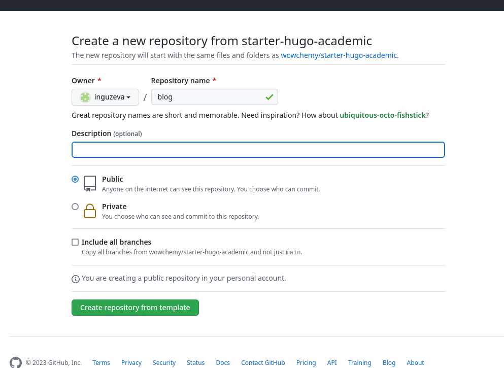
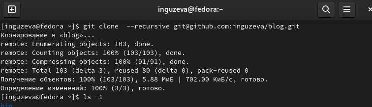
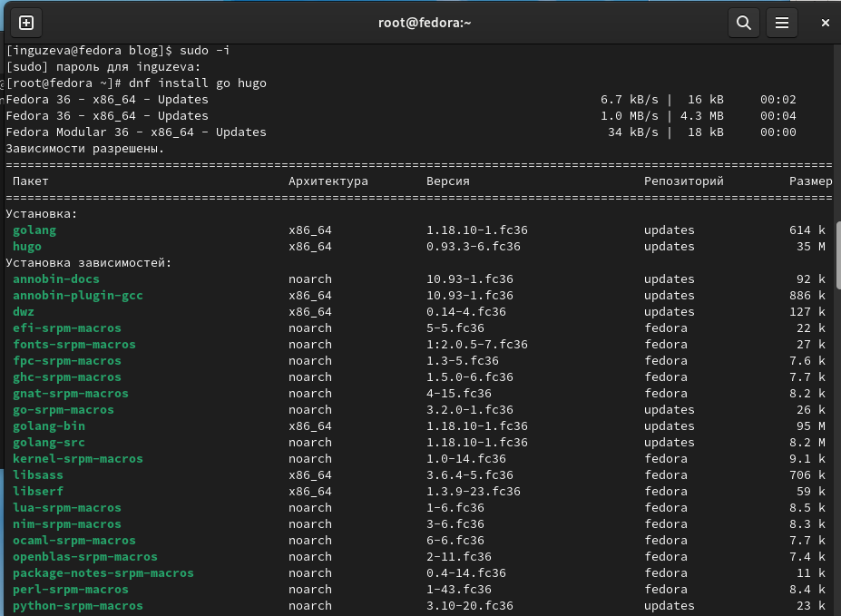
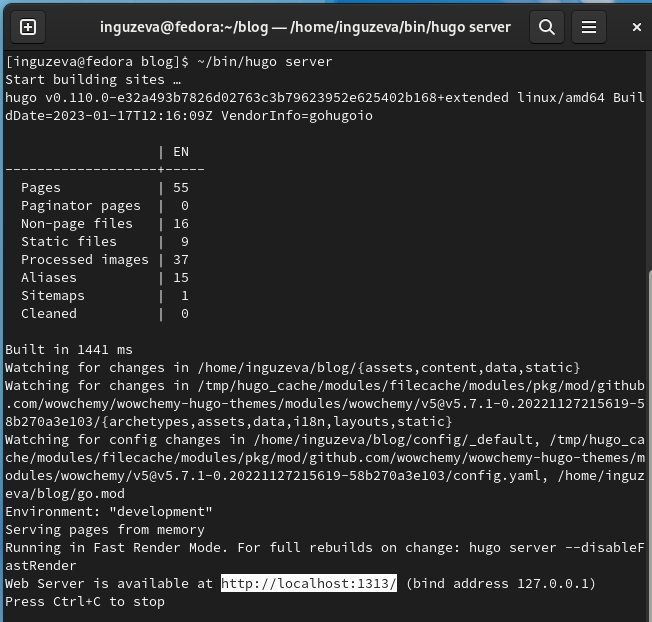
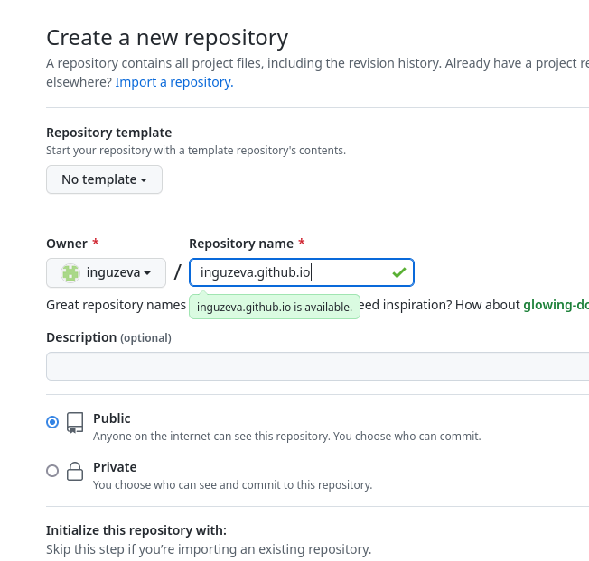
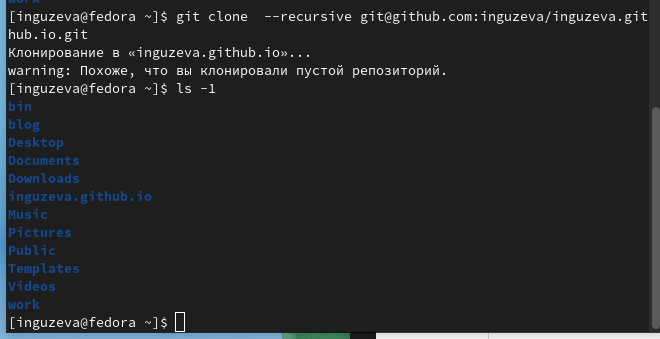
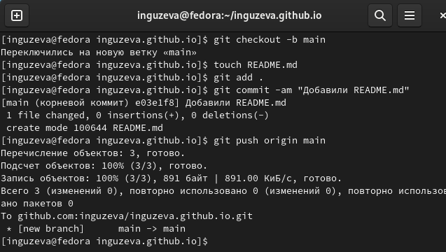
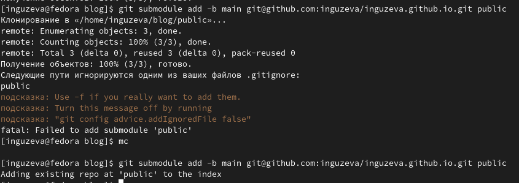
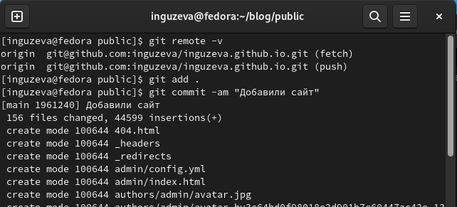

---
## Front matter
title: "Индивидуальный проект. Этап 1."
subtitle: "Размещение на Github pages заготовки для персонального сайта."
author: "Гузева Ирина Николаевна"

## Generic otions
lang: ru-RU
toc-title: "Содержание"

## Bibliography
bibliography: bib/cite.bib
csl: pandoc/csl/gost-r-7-0-5-2008-numeric.csl

## Pdf output format
toc: true # Table of contents
toc-depth: 2
lof: true # List of figures
lot: true # List of tables
fontsize: 12pt
linestretch: 1.5
papersize: a4
documentclass: scrreprt
## I18n polyglossia
polyglossia-lang:
  name: russian
  options:
	- spelling=modern
	- babelshorthands=true
polyglossia-otherlangs:
  name: english
## I18n babel
babel-lang: russian
babel-otherlangs: english
## Fonts
mainfont: PT Serif
romanfont: PT Serif
sansfont: PT Sans
monofont: PT Mono
mainfontoptions: Ligatures=TeX
romanfontoptions: Ligatures=TeX
sansfontoptions: Ligatures=TeX,Scale=MatchLowercase
monofontoptions: Scale=MatchLowercase,Scale=0.9
## Biblatex
biblatex: true
biblio-style: "gost-numeric"
biblatexoptions:
  - parentracker=true
  - backend=biber
  - hyperref=auto
  - language=auto
  - autolang=other*
  - citestyle=gost-numeric

## Misc options
indent: true
header-includes:
  - \usepackage{indentfirst}
  - \usepackage{float} # keep figures where there are in the text
  - \floatplacement{figure}{H} # keep figures where there are in the text
---

# Цель работы

- Установить необходимое программное обеспечение.
- Скачать шаблон темы сайта.
- Разместить его на хостинге git.
- Установить параметр для URLs сайта.
- Разместить заготовку сайта на Github pages.

# Выполнение лабораторной работы

1. Установила исполняемый файл hugo, создала репозиторий blog по шаблону hugo-academic (рис. @fig:001).

{#fig:001 width=70%}

2. Клонировала репозиторий (рис. @fig:002).

{#fig:002 width=70%}

3. Для запуска исполняемого файла установила модуль go (рис. @fig:003).

{#fig:003 width=70%}

4. Запустила исполняемый файл и убедилась в его работе (рис. @fig:004).

{#fig:004 width=70%}

5. Создала репозиторий inguzeva.github.io , необходимый для работы сайта (рис. @fig:005).

{#fig:005 width=70%}

6. Клонировала его в локальный каталог (рис. @fig:006).

{#fig:006 width=70%}

7. Для активация создала пустой файл и выгрузила его на гитхаб (рис. @fig:007).

{#fig:007 width=70%}

8. Создала и подключила папку public к новому репозиторию (рис. @fig:008).

{#fig:008 width=70%}

9. Убедилась в подключении нужного репозитория и добавила сайт на гитхаб (рис. @fig:009).

{#fig:009 width=70%}

10. Открыла сайт, чтобы убедиться, что все сделано верно (рис. @fig:011).

{#fig:011 width=70%}

# Выводы

В ходе выполнения первого этапа проекта я скачала необходимое ПО, скачала шаблон темы сайта и разместила его на хостинге git, разместила сайта на Github Pages

