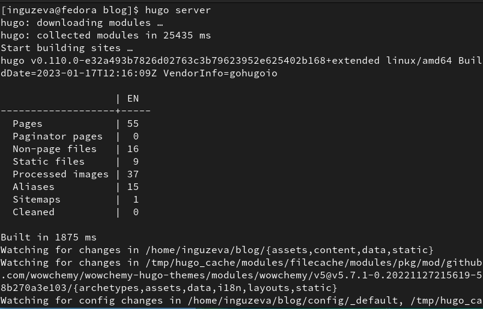
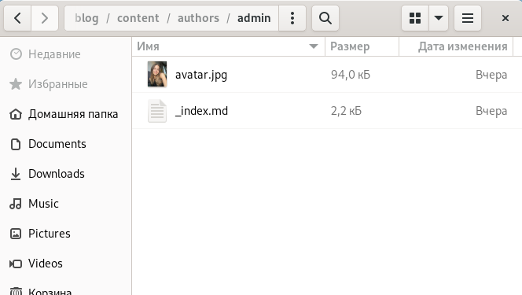
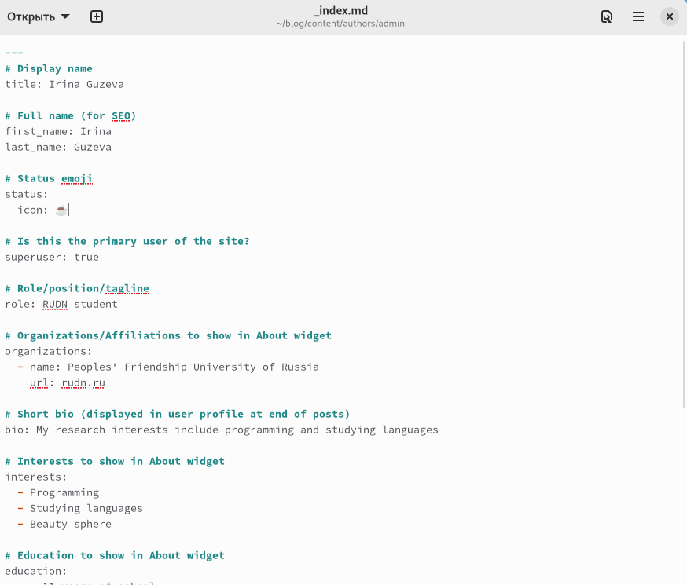
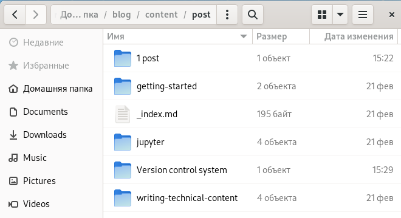
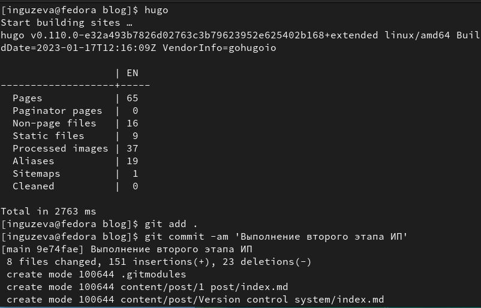
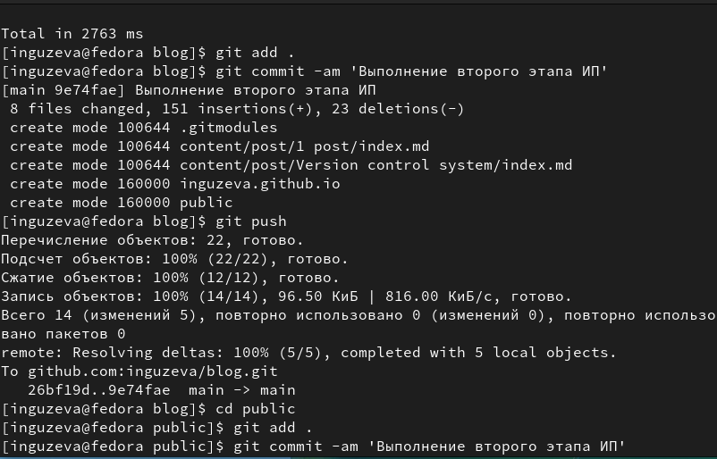
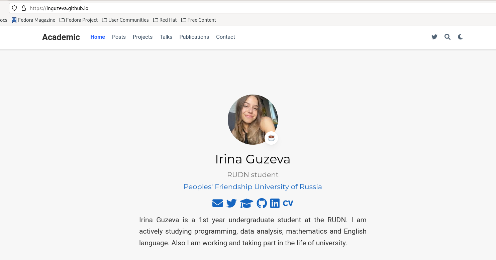

---
## Front matter
lang: ru-RU
title: Индивидуальный проект. Этап №2
subtitle: Добавление на сайт личной информации и постов.
author:
  - Гузева Ирина Николаевна.
institute:
  - Российский университет дружбы народов, Москва, Россия
  - Объединённый институт ядерных исследований, Дубна, Россия
date: 23 февраля 2023

## i18n babel
babel-lang: russian
babel-otherlangs: english

## Formatting pdf
toc: false
toc-title: Содержание
slide_level: 2
aspectratio: 169
section-titles: true
theme: metropolis
header-includes:
 - \metroset{progressbar=frametitle,sectionpage=progressbar,numbering=fraction}
 - '\makeatletter'
 - '\beamer@ignorenonframefalse'
 - '\makeatother'
---

## Цели и задачи

1.	Разместить фотографию владельца сайта.
2.	Разместить краткое описание владельца сайта (Biography).
3.	Добавить информацию об интересах (Interests).
4.	Добавить информацию от образовании (Education).
5.	Сделать пост по прошедшей неделе.
6.	Добавить пост на тему Управление версиями. Git. 

## Команда hugo server

1. Подключилась к серверу

## Добавила аватарку в папку admin

2. Добавила аватарку в папку admin

## Заполнение личных данных

3. Заполнила файл с личной информацией, чтобы далее она отобразилась на
сайте

## Создание папок, написание постов

4. Создала две папки, первую для поста о прошедшей неделе и вторую для
7поста о конроле версий

## Команда hugo

5. Заполнила сайт новыми данными

## Обновление репозиториев

6. Загрузила итоговые данные в репозитории на GitHub

## Результат

7. Вот, что получилось

## Вывод

В процессе выполнения второго этапа индивидуального проекта я научилась редактировать данные о себе, а также писать посты и добывлять их на сайт.

