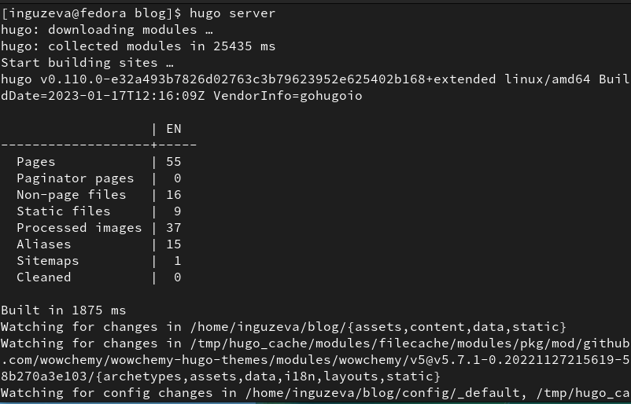
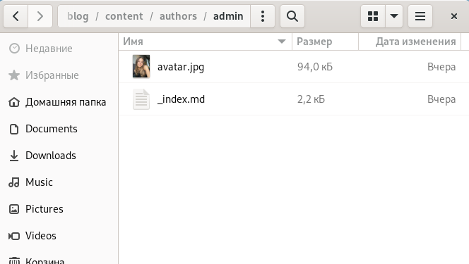
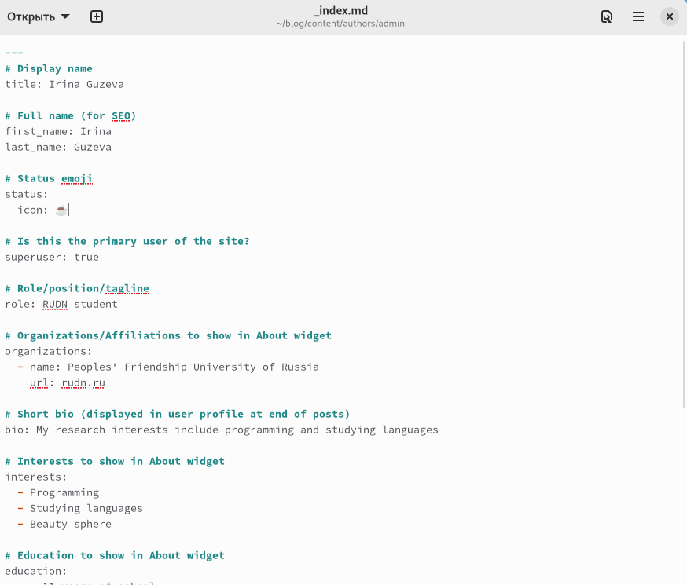
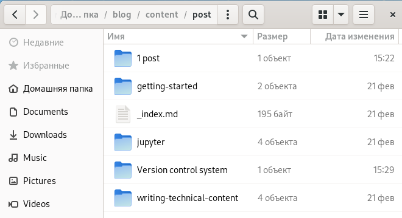
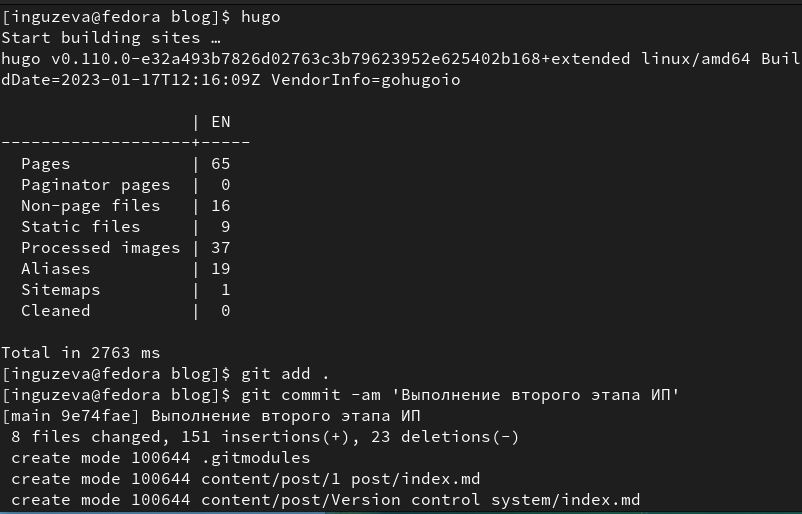
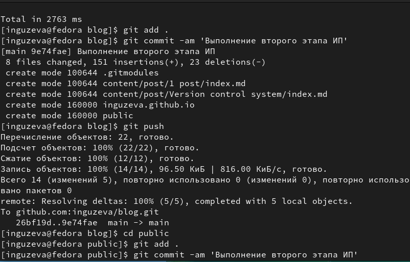
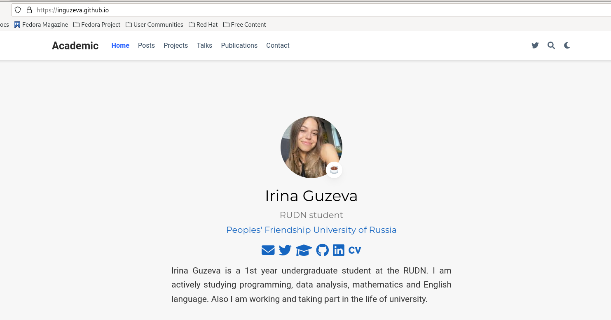

---
## Front matter
title: "Индивидуальный проект. Этап 2."
subtitle: "Добавление на сайт личной информации и постов."
author: "Гузева Ирина Николаевна"

## Generic otions
lang: ru-RU
toc-title: "Содержание"

## Bibliography
bibliography: bib/cite.bib
csl: pandoc/csl/gost-r-7-0-5-2008-numeric.csl

## Pdf output format
toc: true # Table of contents
toc-depth: 2
lof: true # List of figures
lot: true # List of tables
fontsize: 12pt
linestretch: 1.5
papersize: a4
documentclass: scrreprt
## I18n polyglossia
polyglossia-lang:
  name: russian
  options:
	- spelling=modern
	- babelshorthands=true
polyglossia-otherlangs:
  name: english
## I18n babel
babel-lang: russian
babel-otherlangs: english
## Fonts
mainfont: PT Serif
romanfont: PT Serif
sansfont: PT Sans
monofont: PT Mono
mainfontoptions: Ligatures=TeX
romanfontoptions: Ligatures=TeX
sansfontoptions: Ligatures=TeX,Scale=MatchLowercase
monofontoptions: Scale=MatchLowercase,Scale=0.9
## Biblatex
biblatex: true
biblio-style: "gost-numeric"
biblatexoptions:
  - parentracker=true
  - backend=biber
  - hyperref=auto
  - language=auto
  - autolang=other*
  - citestyle=gost-numeric

## Misc options
indent: true
header-includes:
  - \usepackage{indentfirst}
  - \usepackage{float} # keep figures where there are in the text
  - \floatplacement{figure}{H} # keep figures where there are in the text
---

# Цель работы

1.	Разместить фотографию владельца сайта.
2.	Разместить краткое описание владельца сайта (Biography).
3.	Добавить информацию об интересах (Interests).
4.	Добавить информацию от образовании (Education).
5.	Сделать пост по прошедшей неделе.
6.	Добавить пост на тему Управление версиями. Git. 

# Выполнение лабораторной работы

1. Подключилась к серверу (рис. @fig:001).

{#fig:001 width=70%}

2. Добавила аватарку в папку admin (рис. @fig:002).

{#fig:002 width=70%}

3. Заполнила файл с личной информацией, чтобы далее она отобразилась на сайте (рис. @fig:003).

{#fig:003 width=70%}

4. Создала две папки, первую для поста о прошедшей неделе и вторую для поста о конроле версий (рис. @fig:004).

{#fig:004 width=70%}

5. Заполнила сайт новыми данными (рис. @fig:005).

{#fig:005 width=70%}

6. Загрузила итоговые данные в репозитории на (рис. @fig:006).

{#fig:006 width=70%}

7. Вот, что получилось (рис. @fig:007).

{#fig:007 width=70%}

# Выводы

В процессе выполнения второго этапа индивидуального проекта я научилась редактировать данные о себе, а также писать посты и добывлять их на сайт.

