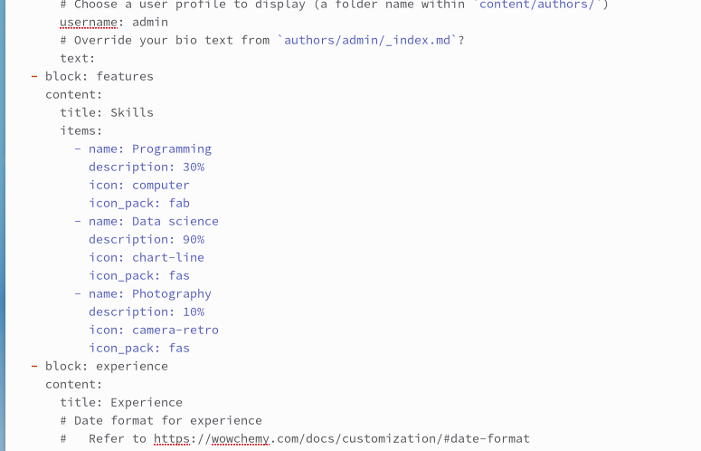
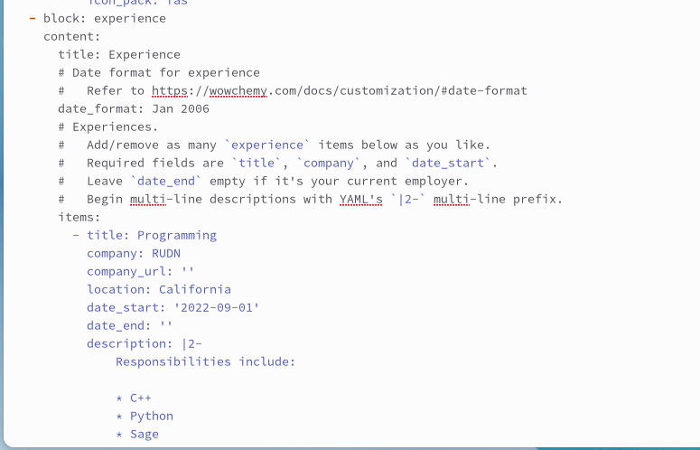
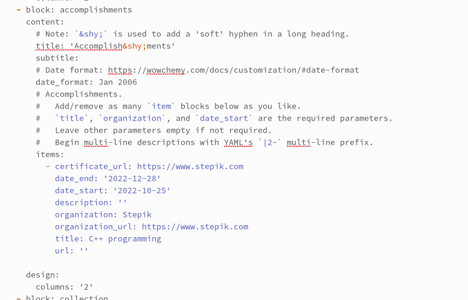
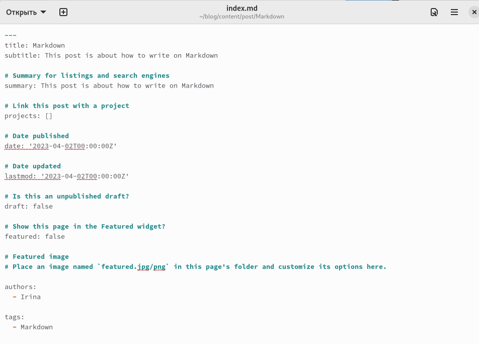
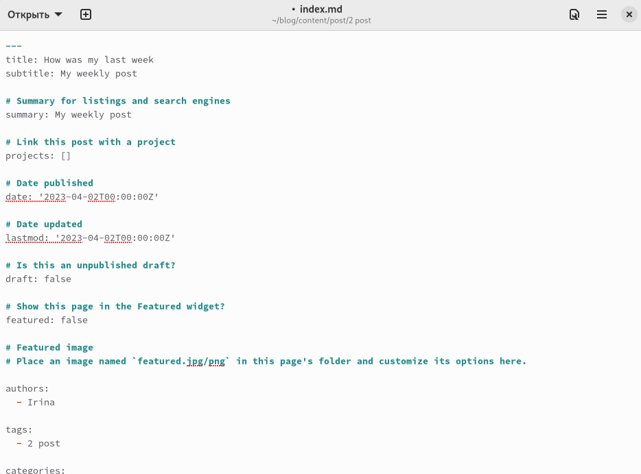
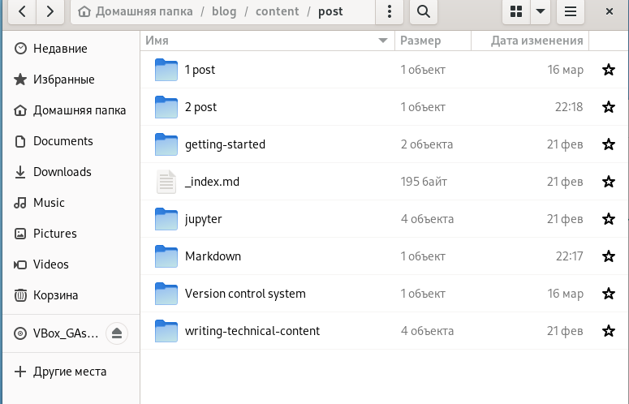

---
## Front matter
lang: ru-RU
title: Индивидуальный проект. Этап №3
subtitle: Добавление на сайт личной информации и постов.
author:
  - Гузева Ирина Николаевна.
institute:
  - Российский университет дружбы народов, Москва, Россия
  - Объединённый институт ядерных исследований, Дубна, Россия
date: 23 февраля 2023

## i18n babel
babel-lang: russian
babel-otherlangs: english

## Formatting pdf
toc: false
toc-title: Содержание
slide_level: 2
aspectratio: 169
section-titles: true
theme: metropolis
header-includes:
 - \metroset{progressbar=frametitle,sectionpage=progressbar,numbering=fraction}
 - '\makeatletter'
 - '\beamer@ignorenonframefalse'
 - '\makeatother'
---

## Цели и задачи

1. Добавить информацию о навыках (Skills).
2. Добавить информацию об опыте (Experience).
3. Добавить информацию о достижениях (Accomplishments).
4. Сделать пост по прошедшей неделе.
5. Добавить пост на тему Язык разметки Markdown.

## Заполнение навыков

1. Подключилась к серверу и заполнила навыки в файле с личной информацией

## Заполнение данных об опыте

2. Заполнила данные об опыте

## Заполнение достижений

3. Заполнила достижение

## Пост про Маркдаун

4. Написала пост про Маркадаун

## Пост по прошедшей неделе

5. Написала пост по прошедшей неделе

## Создание папок

6. Создала папки для постов и загрузила итоговые данные в репозитории на GitHub

## Вывод

В процессе выполнения третьего этапа индивидуального проекта я научилась
редактировать данные о навыках, достижениях и опыте

