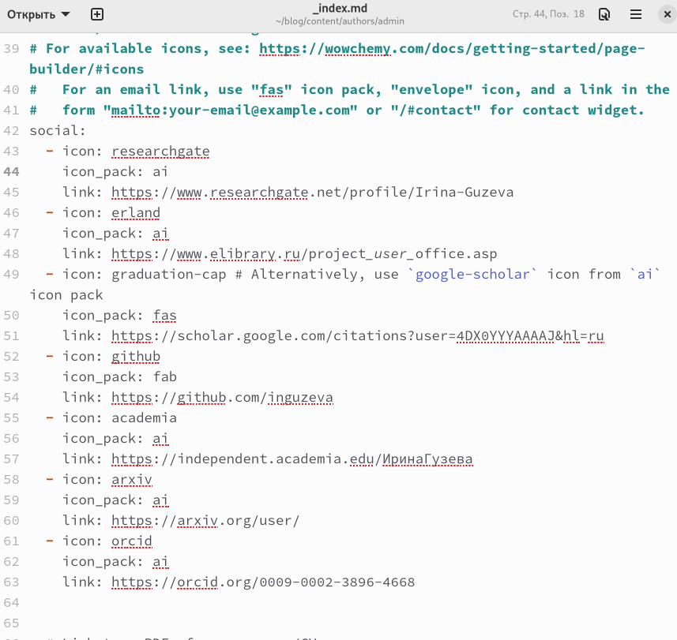
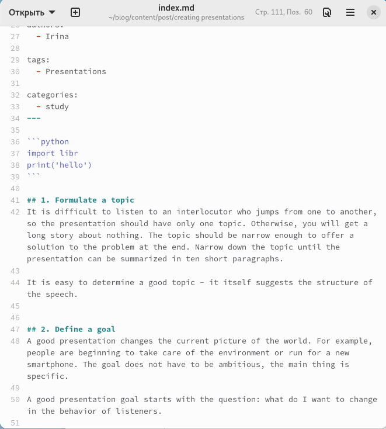
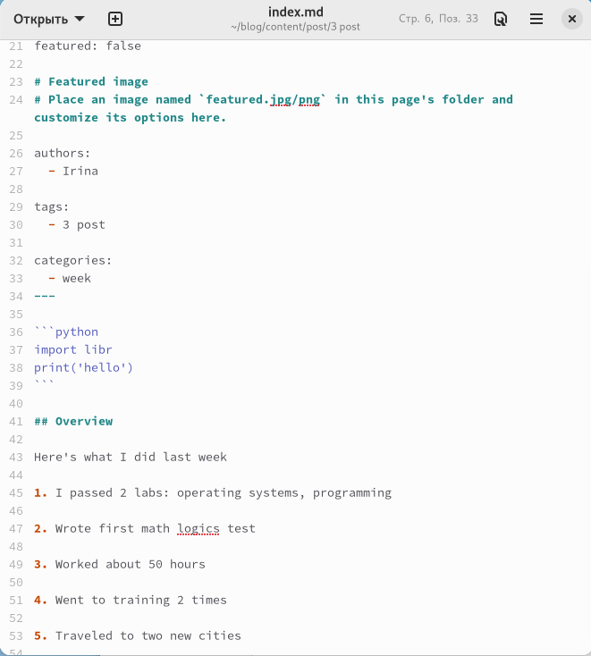
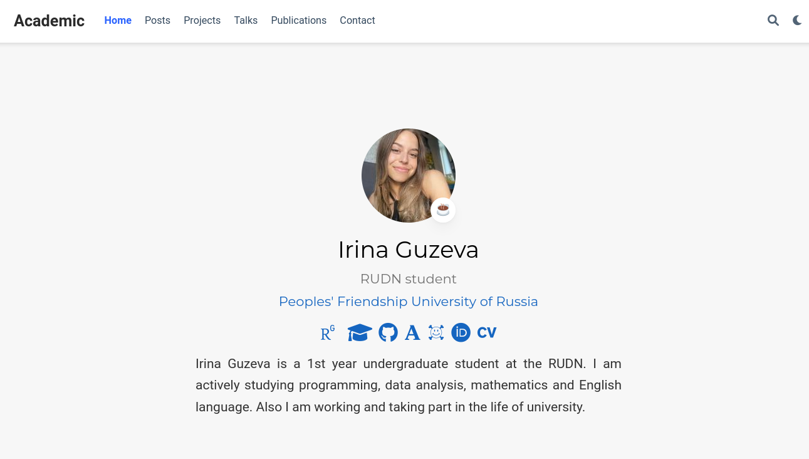

--
## Front matter
lang: ru-RU
title: "Индивидуальный проект. Этап №4"
subtitle: Добавление к сайту ссылок на научные и библиометрические ресурсы.
author:
  - Гузева Ирина Николаевна.
institute:
  - Российский университет дружбы народов, Москва, Россия
date: 27 апреля 2023

## i18n babel
babel-lang: russian
babel-otherlangs: english

## Formatting pdf
toc: false
toc-title: Содержание
slide_level: 2
aspectratio: 169
section-titles: true
theme: metropolis
header-includes:
 - \metroset{progressbar=frametitle,sectionpage=progressbar,numbering=fraction}
 - '\makeatletter'
 - '\beamer@ignorenonframefalse'
 - '\makeatother'
---

## Цели и задачи

1. Зарегистрироваться на соответствующих ресурсах и разместить на них ссылки на сайте:
    - eLibrary : `https://elibrary.ru/`;
    - Google Scholar : `https://scholar.google.com/`;
    - ORCID : `https://orcid.org/`;
    - Mendeley : `https://www.mendeley.com/`;
    - ResearchGate : `https://www.researchgate.net/`;
    - Academia.edu : `https://www.academia.edu/`;
    - arXiv : `https://arxiv.org/`;
    - github : `https://github.com/`.
2. Сделать пост по прошедшей неделе.
3. Добавить пост на тему по выбору:
4. Оформление отчёта.
5. Создание презентаций.
6. Работа с библиографией.

## Добавление ссылок

1. Подключилась к серверу и добавила ссылки на все ресурсы

## Пост про создание презентаций

2. Написала пост про создание презентаций

## Пост по прошедшей неделе

3. Написала пост по прошедшей неделе

## Результат

4. Создала папки для постов и загрузила итоговые данные в репозитории на GitHub

## Вывод

В процессе выполнения четвертого этапа индивидуального проекта я научилась добавлять ссылки на ресурсы
